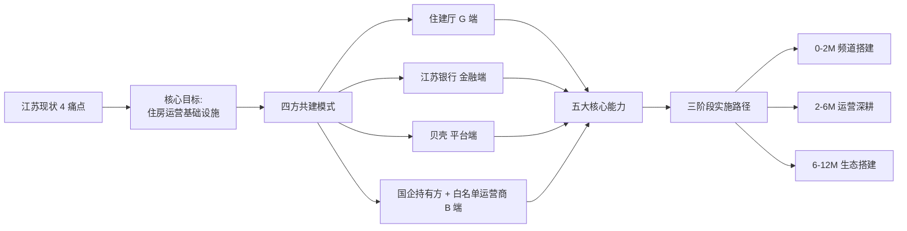
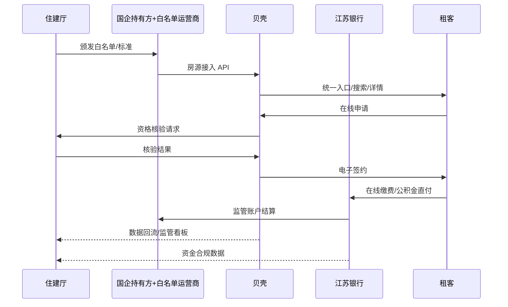
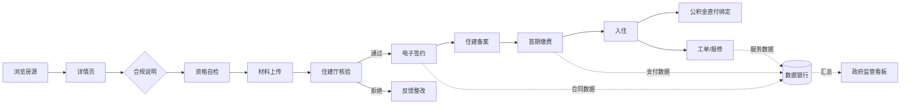
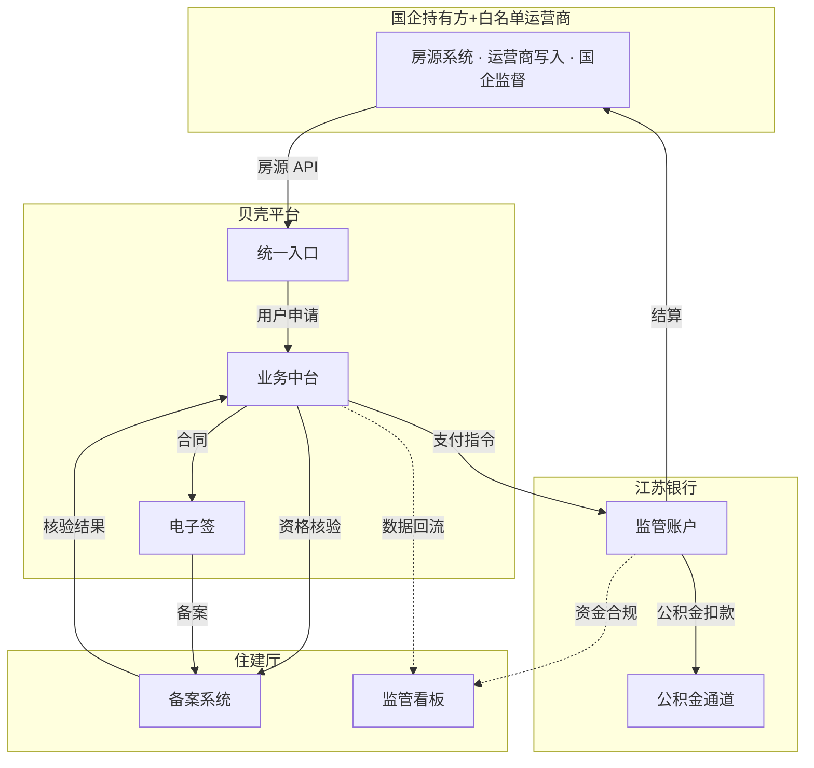

# 保租房专用频道 · 产品需求文档 + 开发计划

**文档版本**：V1.0
**编制日期**：2026-06-05
**编制方**：贝壳租房 × 南京市住建局合作项目组
**适用范围**：南京市试点（0-12 月）+ 江苏全省路线（12-24 月）
**读者**：贝壳内部团队 + 政府方（住建厅 / 国企持有方 / 白名单运营商 / 江苏银行）

---

## 目录

**第一部分 · 项目愿景**（面向决策者）
1. [项目背景](#1-项目背景)
2. [核心目标](#2-核心目标)
3. [四方共建模式](#3-四方共建模式)
4. [各方价值](#4-各方价值)

**第二部分 · 产品范围**
5. [三档版本说明](#5-三档版本说明)
6. [四端功能矩阵](#6-四端功能矩阵)
7. [数据与业务流转](#7-数据与业务流转)
8. [标准体系映射](#8-标准体系映射)

**第三部分 · 开发计划**（面向团队）
9. [三阶段实施路径](#9-三阶段实施路径)
10. [团队与角色](#10-团队与角色)
11. [风险与合规](#11-风险与合规)
12. [验收与上线节奏](#12-验收与上线节奏)

**第四部分 · 附录**
13. [远期路线](#13-远期路线)
14. [引用与术语](#14-引用与术语)
15. [修订记录](#15-修订记录)

---

# 第一部分 · 项目愿景

## 1. 项目背景

### 1.1 一句话定位

> **建立江苏省住房运营基础设施 —— 政府认证、统一入口、标准落地、数据回流的"四方共建"长租平台。**

### 1.2 江苏现状四大痛点

| 痛点 | 现状描述 | 业务影响 |
|---|---|---|
| **房源分散** | 全省保租房分布在 30+ 国企持有方（产权方）+ 持牌运营机构（自如/龙湖/华润/招商/贝壳省心租等），叠加 80+ 第三方平台展示 | 找房成本高、信息不对称、政府无总盘统计 |
| **标准分散** | 各市/各运营方标准不一，"好房子"难落地 | 服务质量参差、品牌信任低 |
| **数据分散** | 房源、租金、入住、合同数据散落在不同系统 | 监管被动、政策制定缺数据支撑 |
| **运营效率低** | 申请、签约、缴费、报修线下流转 | 政府/运营方/租客三方都低效 |

### 1.3 政策驱动

- **国家层面**：住建部"好房子"建设指导意见；十四五保障性租赁住房发展规划
- **江苏省层面**：《江苏租赁行业标准 V25》（项目内：`江苏租赁行业标准_V25.docx`）
- **南京市层面**：南京市保租房接入方案（项目内：`mq0n1457-保租房专用频道2026.6.3.doc`）
- **标准体系**：好房子 58 项评星细则（项目内：`mq0pq2pl-_好房子_标准提案-.xlsx`）

### 1.4 总体图谱

> 参见 `20260605_192600.png` / `20260605_223100.png`（四方共建 × 五大能力 × 三阶段路径）。

---

## 2. 核心目标

### 2.1 三层目标

| 层级 | 时间窗 | 目标 | 前置条件 |
|---|---|---|---|
| **试点跑通** | 0-12 月 | 南京市先选 **3-5 个样板项目**（首批 ≤10 个）接入贝壳频道，跑通"政府认证 + 统一入口 + 标准落地"的模式；46 项目接入数列为"政策推动+自愿复制后的上限假设"，不作为承诺指标 | 政策传导有效、运营商自愿接入 |
| **全省接入** | 12-24 月 | 试点样板项目数据达标后，再启动苏州、无锡、常州等分批复制；不达标则延期/重做试点 | 南京试点关键漏斗+合规指标全部命中（详见 §2.2） |
| **方案输出** | 24 月+ | 全省接入达成且持续运行 ≥6 个月后，江苏模式作为住建部样板向其他省市输出 | 上一档达成 |

> **原则**：政府政策支持 → 房源接入意愿 → 实际接入 是一条**不确定的链路**，每一档都需要前一档的可观测结果作为门槛。"先试点再推进"是项目核心节奏，不要把推广指标当作承诺。

### 2.2 量化指标（北极星 + 关键漏斗）

**北极星指标**（**全部以"试点验证通过后启动"为前置**，不作为承诺指标）
- 接入项目数：南京试点首批 3-5 个 → 模式验证通过 → 推进至 ≥46（上限假设）；全省 ≥500 仅作为远期上限
- 频道月活：南京试点期不设硬指标；模式跑通后 30 万 MAU 作为推广期参考上限
- **真正的承诺指标**：试点项目内的 _关键漏斗命中率_（见下表），命中即"模式跑通"，方可进入推广

**关键漏斗**

| 漏斗节点 | V1（仅展示） | V2（+ 标准） | V3（+ 交易） |
|---|---|---|---|
| 浏览 → 详情查看 | ≥ 25% | ≥ 30% | ≥ 35% |
| 详情 → 资格自检 | — | — | ≥ 20% |
| 自检 → 在线申请 | — | — | ≥ 60% |
| 申请 → 签约 | — | — | ≥ 50% |
| 签约 → 公积金直付开通 | — | — | ≥ 40% |
| 租金合规率 | ≥ 95% | ≥ 98% | ≥ 99% |

---

## 3. 四方共建模式

### 3.1 角色 × 能力矩阵

| 角色 | 输入 | 输出 | 核心能力 |
|---|---|---|---|
| **江苏住建厅**（G 端） | 政策法规、监管要求、标准制定权 | 认证标识、白名单、监管反馈 | 政策制定、标准制定、监管管理（**不直接参与运营**） |
| **江苏银行**（金融端） | 监管账户、公积金通道、清算能力 | 资金安全、公积金直付、数据银行 | 支付体系、监管账户、数据银行 |
| **贝壳 + 白名单运营商**（平台+运营端） | 流量大盘、技术中台、电子签、运营经验、管家/派单/工单团队 | 统一入口、数字化、标准落地、**日常运营动作（派单/上架/管家/工单）** | 流量、技术、数字化、**主导日常运营**（同业含自如/龙湖/华润/招商/贝壳省心租） |
| **国企持有方**（B 端 · 资管视角） | 项目产权、房屋资产、政策性配套 | 房源/资产供给、合规备案、运营商绩效考核 | **资产管理、产权管理、委托运营商监督**（不直接做派单/管家等日常动作） |

### 3.2 协同流程图

### 3.3 数据所有权与权限边界

| 数据类型 | 所有权 | 贝壳读写权限 | 政府读写权限 | 银行读写权限 |
|---|---|---|---|---|
| 房源信息 | **持有方=国企**（产权）/ **运营权=白名单运营商**（上下架/价格/状态由运营商写入，国企监督） | 读+写（公示） | 读 | 读 |
| 用户行为 | 贝壳 | 读+写 | 仅汇总 | 不可读 |
| 申请资格数据 | 住建厅 | 读（脱敏） | 读+写 | 不可读 |
| 合同备案 | 住建厅 | 读+写（接口） | 读+写 | 读 |
| 资金流水 | 江苏银行 | 仅状态回传 | 读 | 读+写 |
| 监管账户余额 | 住建厅 + 江苏银行 | 不可读 | 读 | 读+写 |

---

## 4. 各方价值

### 4.1 对住建厅

- **监管在线化**：从被动报表 → 实时看板（参考 `screens/gov-admin.html` 原型）—— 试点期先看 3-5 个项目的看板形态
- **合规可视化**：租金价格、入住率、合同备案率一屏可见（覆盖范围随接入项目增长而扩大）
- **政策直达通道**：提供"政策更新 → 频道首屏"的通道；**真实触达率随试点观测**，不预设 30 万 MAU 必达
- **数据驱动决策**：从"经验决策" → "数据决策"，支撑下一轮政策制定（数据量随试点-推广分阶段累积）

### 4.2 对江苏银行

- **监管账户沉淀**：保租房月租金流水预估 5-8 亿/月，沉淀活期存款
- **公积金通道扩容**：直付场景使用频次显著提升，巩固公积金代发优势
- **数据银行场景**：租赁数据 → 信贷模型新增维度
- **政府合作背书**：与住建厅深度绑定，提升省内地位

### 4.3 对国企持有方（资管视角）+ 白名单运营商

**对国企持有方**（产权方 / 资管方，不直接做日常运营）：
- **资产盘活**：流量端解决获客，预计入住率提升 10-15 个百分点 → 资产估值提升
- **运营商可比可换**：多家白名单运营商接入同一平台，可横向对比 SLA + 收益，降低单家锁定风险
- **品质背书**："白名单 + 星级评价" → 资产可溢价 + 可证券化（REITs）
- **资管看板**：直接获得入住率/收入/合规/运营商绩效大盘（B 端"国企资管视角"），不再依赖运营商月报

**对白名单运营商**（自如 / 龙湖 / 华润 / 招商 / 贝壳省心租等同业）：
- **流量获客**：贝壳频道作为统一流量入口，去化效率显著提升
- **运营降本**：电子签 / 在线缴费 / 报修平台化，减少 30% 线下人力
- **数字化能力**：免费获得贝壳数字化中台能力（CRM、工单、看板）
- **同业开放**：以白名单准入方式接入，避免"贝壳独占"的合作阻力

### 4.4 对贝壳

- **流量场景**：长租 + 政策性住房作为高频低决策成本场景，激活年轻用户
- **长租生态**：占位"政府合作长租平台"心智，对抗自如/相寓等竞品
- **政府合作样板**：江苏经验输出 → 其他省份复制 → 政策性长租赛道领跑
- **数据资产**：累积城市级租赁数据，反哺商业租房与买卖业务

---

# 第二部分 · 产品范围

## 5. 三档版本说明

> 已实现的可视化对比页：[`baozufang-channel-overview.html`](baozufang-channel-overview.html)（三档总入口）

### 5.1 版本边界

| 维度 | V1 · 仅展示 | V2 · + 标准体系 | V3 · + 交易闭环 |
|---|---|---|---|
| **商业目标** | 占位获客 | 品牌信任 | 运营闭环 |
| **页面数** | 4（C 端） | 7（C 端 + G 端最小） | 28（全四端） |
| **上线周期** | 4-6 周 | 6-9 周（增量） | 14-18 周（增量） |
| **合规风险** | 低 | 低 | 中高 |
| **可视化锚点** | [v1-basic.html](baozufang-overview-v1-basic.html) | [v2-standard.html](baozufang-overview-v2-standard.html) | [v3-full.html](baozufang-overview-v3-full.html) |

### 5.2 升级条件（出口准则）

**V1 → V2**：
- 住建厅"好房子"标准体系正式发布（前置）
- 至少 6 家运营白名单完成审核（前置）
- **物资供应商白名单 ≥ 3 家完成审核**（前置，至少覆盖家具/家电/建材 各 1 家；试点期目标，对应 §8.1 物资认证类目）
- 一期 4 页 C 端日均 PV ≥ 5 万（验收）

**V2 → V3**：
- 江苏银行监管账户产品上线（前置）
- 电子签平台与住建厅备案系统打通（前置）
- 公积金直付通道开通（前置）
- V2 期间累积有效申请意向 ≥ 1 万（验收）

### 5.3 互斥项与回退策略

- V1 详情页"立即申请"按钮 = 咨询电话；V2 = 同上 + 标准体系跳转；V3 = 在线资格自检
- 若 V3 上线后某个城市政府配套未到位，可降级回 V2 形态（前端 feature flag 控制）

---

## 6. 四端功能矩阵

### 6.1 总览（28 个页面）

| 端 | 已建页面 | 新增页面 | 总计 | 优先级 |
|---|---|---|---|---|
| C 端（租客） | 12 | 4 | **16** | P0 |
| B 端（国企持有方 + 白名单运营商 + 业主） | 1 | 3 | **4** | P1 |
| G 端（住建厅监管） | 1 | 3 | **4** | P1 |
| 金融端（江苏银行） | 0 | 3 | **3** | P2 |
| 系统/接口（API 文档化） | 1 | 0 | **1** | P0 |
| **合计** | **15** | **13** | **28** | — |

### 6.2 C 端 · 租客（16 页）

| # | 页面 | 文件 | 功能要点 | 所属版本 | 状态 |
|---|---|---|---|---|---|
| C-01 | 频道首页 | [`screens/home.html`](screens/home.html) | 3 张幻灯 + 房源列表 + 申请流程 + 标准体系入口 | V1+ | ✅ 已建 |
| C-02 | 房源详情 | [`screens/detail.html`](screens/detail.html) | 实景图 + 价格对比 + 配套 + 申请条件 | V1+ | ✅ 已建 |
| C-03 | 政策资讯 | [`screens/policy.html`](screens/policy.html) | 政策列表 + FAQ + 标准体系入口 | V1+ | ✅ 已建 |
| C-04 | 个人中心 | [`screens/profile.html`](screens/profile.html) | 我的服务入口 + 申请记录 + 收藏 | V1+ | ✅ 已建 |
| C-05 | 申请/资格 | [`screens/apply.html`](screens/apply.html) | 三步流程 + 自动校验 + 材料上传 | V3 | ✅ 已建 |
| C-06 | 我的申请 | [`screens/my-applications.html`](screens/my-applications.html) | 状态看板 + 进度追踪 | V3 | ✅ 已建 |
| C-07 | 电子合同 | [`screens/contracts.html`](screens/contracts.html) | 待签 / 已签 / 已到期 | V3 | ✅ 已建 |
| C-08 | 在线缴费 | [`screens/payment.html`](screens/payment.html) | 多支付方式 + 自动代扣 | V3 | ✅ 已建 |
| C-09 | 报修服务 | [`screens/repair.html`](screens/repair.html) | 分类 + 照片 + 进度 | V3 | ✅ 已建 |
| C-10 | 运营白名单 | [`screens/operators.html`](screens/operators.html) | 6 家机构 + 资质 | V2+ | ✅ 已建 |
| C-11 | 服务者认证 | [`screens/service-workers.html`](screens/service-workers.html) | 24 人 + 评分 | V2+ | ✅ 已建 |
| C-12 | 合格供应商（V2 扩 6 品类） | [`screens/suppliers.html`](screens/suppliers.html) | 6 品类（家具/家电/建材/智能锁/涂料/卫浴）+ 供应商 LV 分级 + 认证有效期 | V2+ | ✅ 已建（V2 扩展待做） |
| C-13 | **公积金直付申请**（新增） | `screens/c-housing-fund.html` | 授权扫码 + 额度查询 + 直付绑定 | V3 | 🟡 待建 |
| C-14 | **房源对比**（新增） | `screens/c-compare.html` | 3 套房源横向对比（价/配/星/通勤） | V2 | 🟡 待建 |
| C-15 | **客群分流首页变体**（新增） | `screens/c-persona-home.html` | 人才 / 新市民 / 青年 三入口 | V2 | 🟡 待建 |
| C-16 | **租金合规说明**（新增） | `screens/c-rent-compliance.html` | ≤90% 市价、年涨 ≤5% 可视化 | V1 | 🟡 待建 |

### 6.3 B 端 · 国企持有方（资管视角）+ 白名单运营商（运营动作）+ 业主（4 页）

> **视角拆分**：B-02 是国企持有方"资管视角"主页；B-03 / B-04 是白名单运营商日常动作页（国企方可查看，但不做派单/上下架的日常操作）。

| # | 页面 | 文件 | 功能要点 | 使用方 | 所属版本 | 状态 |
|---|---|---|---|---|---|---|
| B-01 | 业主托管 | [`screens/landlord.html`](screens/landlord.html) | 个人业主托管入口（雏形） | 个人业主 | V2+ | ✅ 已建 |
| B-02 | **资管大盘**（新增） | `screens/b-operator-console.html` | 入住率 + 收入大盘 + 合同到期提醒 + 运营商绩效 | **国企持有方** | V3 | 🟡 待建 |
| B-03 | **房源上下架管理**（新增） | `screens/b-listing-mgmt.html` | 批量上架 / 价格调整 / 状态变更 | **白名单运营商**（国企只读） | V3 | 🟡 待建 |
| B-04 | **工单分派与入住率看板**（新增） | `screens/b-occupancy.html` | 工单池 / 自动派单 / 入住率分析 | **白名单运营商**（国企只读 SLA） | V3 | 🟡 待建 |

### 6.4 G 端 · 住建厅监管（4 页）

| # | 页面 | 文件 | 功能要点 | 所属版本 | 状态 |
|---|---|---|---|---|---|
| G-01 | 政府监管视图 | [`screens/gov-admin.html`](screens/gov-admin.html) | 监管总览（雏形） | V2+ | ✅ 已建 |
| G-02 | **监管数据大屏**（新增） | `screens/g-dashboard.html` | 全市/全省地图 + 关键指标 + 告警 | V3 | 🟡 待建 |
| G-03 | **租金合规预警**（新增） | `screens/g-rent-alert.html` | 超标房源列表 + 处置流程 | V3 | 🟡 待建 |
| G-04 | **白名单审核**（新增） | `screens/g-whitelist-review.html` | 运营方 / 服务者 / 供应商资质审核 | V2 | 🟡 待建 |

### 6.5 金融端 · 江苏银行（3 页）

| # | 页面 | 文件 | 功能要点 | 所属版本 | 状态 |
|---|---|---|---|---|---|
| F-01 | **监管账户对账**（新增） | `screens/f-escrow.html` | 监管账户余额 + 流水 + 对账单 | V3 | 🟡 待建 |
| F-02 | **公积金直付通道**（新增） | `screens/f-housing-fund.html` | 直付授权列表 + 额度管理 + 异常处理 | V3 | 🟡 待建 |
| F-03 | **资金流水大盘**（新增） | `screens/f-treasury.html` | 全市/全省资金流向可视化 | V3 | 🟡 待建 |

### 6.6 系统/接口（1 页）

| # | 页面 | 文件 | 功能要点 | 状态 |
|---|---|---|---|---|
| S-01 | 房源接入 API 文档 | [`screens/property-intake-api.html`](screens/property-intake-api.html) | 接入规范（雏形） | ✅ 已建 |

### 6.7 三向对齐矩阵（28 页 × 3 版本 × 3 阶段）

| 页面 | V1 | V2 | V3 | 阶段 |
|---|:-:|:-:|:-:|:-:|
| C-01 首页 | ● | ● | ● | 一 |
| C-02 详情 | ● | ● | ● | 一 |
| C-03 政策 | ● | ● | ● | 一 |
| C-04 个人中心 | ● | ● | ● | 一 |
| C-16 租金合规说明 🆕 | ● | ● | ● | 一 |
| C-10 运营白名单 | | ● | ● | 二 |
| C-11 服务者认证 | | ● | ● | 二 |
| C-12 合格供应商 | | ● | ● | 二 |
| C-14 房源对比 🆕 | | ● | ● | 二 |
| C-15 客群分流首页 🆕 | | ● | ● | 二 |
| G-01 政府监管视图 | | ● | ● | 二 |
| G-04 白名单审核 🆕 | | ● | ● | 二 |
| C-05 申请/资格 | | | ● | 三 |
| C-06 我的申请 | | | ● | 三 |
| C-07 电子合同 | | | ● | 三 |
| C-08 在线缴费 | | | ● | 三 |
| C-09 报修服务 | | | ● | 三 |
| C-13 公积金直付申请 🆕 | | | ● | 三 |
| B-01 业主托管 | | | ● | 三 |
| B-02 国企工作台 🆕 | | | ● | 三 |
| B-03 房源管理 🆕 | | | ● | 三 |
| B-04 工单看板 🆕 | | | ● | 三 |
| G-02 监管大屏 🆕 | | | ● | 三 |
| G-03 租金合规预警 🆕 | | | ● | 三 |
| F-01 监管账户对账 🆕 | | | ● | 三 |
| F-02 公积金直付通道 🆕 | | | ● | 三 |
| F-03 资金流水大盘 🆕 | | | ● | 三 |
| S-01 房源接入 API | ● | ● | ● | 一 |

🆕 = 本 PRD 新增页面 ; ● = 该版本/阶段包含此页面

---

## 7. 数据与业务流转

### 7.1 端到端业务流（C 端视角）

### 7.2 数据流转图（四方）

### 7.3 核心接口契约

| 接口 | 提供方 → 消费方 | 用途 | 优先级 |
|---|---|---|---|
| **房源接入 API** | 国企 → 贝壳 | 房源上下架、价格、状态同步 | P0（V1） |
| **资格核验 API** | 住建厅 → 贝壳 | 户籍 / 社保 / 收入 / 自有房产校验 | P0（V3） |
| **电子合同 API** | 贝壳 → 住建备案 | 三方电子合同生成、签署、备案 | P0（V3） |
| **支付 API** | 江苏银行 → 贝壳 | 监管账户支付、查询、退款 | P0（V3） |
| **公积金直付 API** | 江苏银行 → 贝壳 | 公积金代扣授权、扣款、对账 | P1（V3） |
| **监管数据回流 API** | 贝壳 → 住建厅 | T+1 房源、入住、租金、申请汇总 | P0（V2） |
| **政策资讯 API** | 住建厅 → 贝壳 | 政策推送、变更通知 | P1（V1） |
| **白名单同步 API** | 住建厅 → 贝壳 | 运营方/服务者/供应商资质同步 | P0（V2） |

详细接口字段、错误码、SLA 见 `screens/property-intake-api.html` 示例及后续单独维护的《接口手册 V1.0》。

### 7.4 数据安全与权限

- **个人敏感信息**：身份证、社保、公积金号 → 全链路加密 + 脱敏存储
- **资金数据**：贝壳侧只保留交易状态，不存任何资金详情
- **政府数据**：白名单、备案、监管指标的写入权限严格限定政府方
- **数据出境**：所有数据存储在境内、不传境外
- **数据保留**：按《个人信息保护法》要求最短化保留

---

## 8. 标准体系映射

> 来源：`_好房子_标准提案-.xlsx`（58 项评星细则）

### 8.1 标准 → 产品落地映射

| 标准类目 | 项数 | 落地形式 | 关联页面 |
|---|---|---|---|
| 房屋本体（智能门锁、独立卫浴、采光等） | 18 | 详情页基础信息 + 实景图标记 | C-02 详情 |
| 公共配套（电梯、健身房、公共厨房等） | 12 | 详情页配套清单 | C-02 详情 |
| **物资认证（家具/家电/建材/智能锁/涂料/卫浴 6 类）** | 6 | 详情页"环保认证 6 类"徽章 + 合格供应商公示 + 扫码验真 | **C-02 / C-12 / portal-verify** |
| 服务标准（管家响应、报修时效等） | 14 | 服务者认证页 + 报修工单 SLA | C-11 / C-09 |
| 运营透明度（合同、价格、监管账户等） | 8 | 运营白名单 + 监管账户对账 | C-10 / F-01 |
| 租客权益（押一付一、租金贷红线等） | 6 | 申请条件 + 合规说明 | C-05 / C-16 |

### 8.2 星级评价规则

- **三星 · 舒适型**：满足房屋本体 + 基础公共配套 + **物资认证 ≥3/6 类**
- **四星 · 优质型**：+ 服务标准达标 + 24H 管家 + **物资认证 5/6 类**
- **五星 · 旗舰型**：+ 运营透明度达标 + 完善权益保障 + **物资认证 6/6 类全覆盖**

详情见 `screens/home.html` 折叠组件 "房源星级评价标准"。

### 8.3 公示要求

| 标准类目 | 公示渠道 | 更新频率 |
|---|---|---|
| 房屋本体 / 公共配套 | 详情页 | 实时（房源变更同步） |
| 服务标准 | 服务者认证页 | 月度（评分更新） |
| 运营透明度 | 运营白名单页 + 年度报告 | 季度 |
| 评星结果 | 房源卡 + 详情页徽章 | 年度（再评） |

---

# 第三部分 · 开发计划

## 9. 三阶段实施路径

### 9.1 总览

| 阶段 | 周期 | 对应版本 | 核心交付 | 出口标准（stage-gate） | 协作方 |
|---|---|---|---|---|---|
| **阶段一 · 频道搭建（试点）** | 0-2 月 | V1 仅展示 | 5 页 C 端 + 房源接入 + 入口投放 | **试点 3-5 个样板项目模式跑通**（接入+展示+基本指标），不要求 46 项目全量；日 PV ≥ 5 万作为推广启动条件 | 贝壳 + 国企持有方 + 1-2 家白名单运营商 |
| **阶段二 · 运营深耕** | 2-6 月 | V2 + 标准体系 | + 5 页（3 标准 + 1 对比 + 1 客群）+ G 端最小监管面（2 页） | **阶段一出口达成**后启动；命中即推进至 1 万入住意向 + 政府监管看板小范围上线 | + 住建厅 |
| **阶段三 · 生态搭建** | 6-12 月 | V3 + 交易闭环 | + 18 页（5 交易 + 1 公积金 + 3 B 端 + 2 G 端 + 3 金融端 + 4 业主补充） | **阶段二出口达成 + 金融/电签合规就绪**后启动；命中即在线签约率 ≥ 50% + 监管账户运行 + 公积金直付通道开通 | + 江苏银行 |

> **stage-gate 规则**：每个阶段的"出口标准"是下一阶段启动的**门槛条件**，不是"自动滚动到下个阶段"的承诺。未达标则在本阶段延期、重做或缩小范围。

### 9.2 阶段一 · 频道搭建（0-2 月）

**Sprint 1.1（W1-W2）· 信息架构与设计**
- 用户故事：作为租客，能在贝壳 APP 首页发现"南京保租房"入口
- 任务：信息架构定稿、视觉规范确认、入口位置 ABTest 设计
- 交付：UI Kit、首页改造方案
- 依赖：贝壳主 APP 首页排期协调
- 验收：设计评审通过 + 入口位获产品决策委员会批准

**Sprint 1.2（W3-W5）· 核心页前端**
- 用户故事：作为租客，能浏览房源、查看详情、阅读政策、收藏
- 任务：开发 C-01/C-02/C-03/C-04/C-16 五个页面
- 复用：已有 [`index.html`](index.html) / [`screens/detail.html`](screens/detail.html) 等原型，按贝壳设计规范重构
- 验收：5 页 H5 + 小程序双端打通；Lighthouse 性能分 ≥ 85

**Sprint 1.3（W6-W8）· 房源接入与上线（试点先行）**
- 用户故事：作为白名单运营商（受国企委托），能通过 API 上传/更新房源；国企可在资管大盘看到接入状态
- 任务：房源接入 API（参考 [`screens/property-intake-api.html`](screens/property-intake-api.html)）、数据清洗、**先接 3-5 个样板项目**（覆盖国企自管 + 委托运营 + 深度托管 三种模式各 1 例）
- 验收：样板项目房源稳定入库 + 同步任务 SLA 达标；其他项目接入排队，根据样板表现+政府推动节奏自愿复制
- 风险：政策推动力 ≠ 实际接入意愿，需准备样板案例去说服更多项目；运营商 IT 能力参差，需准备 Excel 兜底导入方案

### 9.3 阶段二 · 运营深耕（2-6 月）

**Sprint 2.1（W9-W12）· 标准体系上线**
- 任务：C-10/C-11/C-12 三页（已有原型，重构对接真实数据）、白名单数据接入；**C-12 扩 6 品类物资 + 详情页 C-02 加"物资认证 6 类"徽章 + portal-verify 加物资批次验真**
- 关键依赖：住建厅"好房子"标准正式发布、6 家运营白名单审核完成、**≥3 家物资供应商完成审核**
- 验收：标准体系四入口在首页展示；白名单实时同步；**试点项目至少 1 套房展示完整"物资 6/6"徽章**

**Sprint 2.2（W13-W16）· C 端转化优化**
- 任务：C-14 房源对比、C-15 客群分流首页（人才/新市民/青年）
- ABTest：分流首页 vs 通用首页，目标提升详情页 CTR 20%
- 验收：分流首页转化优于通用首页且通过显著性检验

**Sprint 2.3（W17-W20）· G 端最小监管面**
- 任务：G-01 重构（监管视图）、G-04 白名单审核
- 关键依赖：住建厅信息中心提供监管账号 / 单点登录对接
- 验收：住建厅工作人员可登录、查看监管总览、审核白名单
- 风险：政府 IT 接入流程长（预留 4 周）

**Sprint 2.4（W21-W24）· 数据回流与运营动作**
- 任务：监管数据回流 API、运营动作配置（首页推荐、政策推送）
- 验收：监管数据 T+1 准时；运营可在后台配置首页推荐位

### 9.4 阶段三 · 生态搭建（6-12 月）

**Sprint 3.1-3.2（W25-W32）· 交易闭环上半段**
- 任务：C-05 申请、C-06 我的申请、C-07 电子合同
- 关键依赖：电子签平台对接、住建备案接口联调
- 验收：完整跑通"申请 → 核验 → 签约 → 备案"链路；100 例真实订单

**Sprint 3.3-3.4（W33-W40）· 交易闭环下半段**
- 任务：C-08 在线缴费、C-09 报修、C-13 公积金直付申请
- 关键依赖：江苏银行监管账户产品上线、公积金直付通道开通
- 验收：监管账户每月对账无差错；公积金直付成功率 ≥ 95%
- 风险：金融合规审批周期不确定

**Sprint 3.5-3.6（W41-W46）· B 端工作台**
- 任务：B-02 国企工作台、B-03 房源管理、B-04 工单看板
- 配套：B-01 业主托管完善（个人业主小规模灰度）
- 验收：6 家运营方全部启用工作台；工单平均处理时长 < 24h

**Sprint 3.7-3.8（W47-W52）· G 端 + 金融端**
- 任务：G-02 监管大屏、G-03 租金合规预警；F-01/F-02/F-03 三页
- 验收：住建厅大屏在指挥中心展示；江苏银行内部看板上线
- 收尾：12 月底数据复盘、为全省扩展做准备

### 9.5 关键里程碑表

| 里程碑 | 时间 | 内容 | 责任方 |
|---|---|---|---|
| M0 | 2026-06-15 | 项目启动会、PRD 评审 | 贝壳 PMO |
| M1 | 2026-08-15 | V1 上线（5 页 + 46 项目接入） | 贝壳前端 + 国企 |
| M2 | 2026-12-15 | V2 上线（含标准体系 + G 端监管） | 贝壳 + 住建厅 |
| M3 | 2027-04-15 | V3 上半段（C 端交易闭环） | 贝壳 + 电子签 |
| M4 | 2027-06-15 | V3 全量（金融通道 + B/G 端工作台） | 全四方 |
| M5 | 2027-07-01 | 全省扩展方案评审 | 项目委员会 |

---

## 10. 团队与角色

### 10.1 贝壳侧人头估算

| 角色 | 阶段一（人月） | 阶段二（人月） | 阶段三（人月） | 备注 |
|---|---|---|---|---|
| 产品经理 | 2 × 2 = 4 | 2 × 4 = 8 | 3 × 6 = 18 | V3 需金融/政府双线 |
| 设计师 | 1 × 2 = 2 | 2 × 4 = 8 | 2 × 6 = 12 | UI + UX |
| 前端 | 3 × 2 = 6 | 3 × 4 = 12 | 5 × 6 = 30 | H5 + 小程序 + B 端 React |
| 后端 | 3 × 2 = 6 | 4 × 4 = 16 | 6 × 6 = 36 | 含数据中台 |
| 测试 | 1 × 2 = 2 | 2 × 4 = 8 | 3 × 6 = 18 | 含自动化 |
| 合规/法务 | 0.5 × 2 = 1 | 1 × 4 = 4 | 1.5 × 6 = 9 | V3 涉及资金/电子签 |
| **小计** | **21 人月** | **56 人月** | **123 人月** | 总计约 200 人月 |

### 10.2 外部协作接口人

| 协作方 | 接口人角色 | 沟通频率 |
|---|---|---|
| 南京市住建局信息中心 | 系统对接负责人 | 阶段二起每周 |
| 江苏银行个金/科技部 | 监管账户产品经理 + 公积金通道经理 | 阶段三起每周 |
| 国企持有方（× 6 持有方） + 白名单运营商（× N 家） | 国企：资管负责人；运营商：IT + 运营负责人 | 阶段一起每周 |
| 电子签平台 | 商务 + 技术对接 | 阶段三起每两周 |

### 10.3 决策机制

- **日常**：贝壳项目组内部 daily standup
- **跨方**：四方周会（住建厅 / 国企 / 江苏银行 / 贝壳）
- **重大**：项目委员会月会（含住建局副局长、贝壳事业部负责人）

---

## 11. 风险与合规

### 11.1 风险矩阵

| 类别 | 风险描述 | 概率 | 影响 | 应对策略 |
|---|---|---|---|---|
| **政策→接入（核心）** | **政府政策支持未能有效转化为房源接入**：政策传导链路长，国企持有方与白名单运营商实际接入意愿不可控（不进入、慢进入、形式进入） | **高** | **极高** | 项目核心节奏改为"**1-2 个样板项目跑通 → 以样板自愿复制**"，**不依赖行政强推**；阶段一目标改为"模式跑通"而非"项目数"；保留降级路径（频道照常运行但接入项目少）|
| 政策 | 住建厅"好房子"标准延期发布 | 中 | 高 | V1 可独立上线；V2 改造为标准灰度 |
| 政策 | 数据回流监管要求变化 | 中 | 中 | 接口字段按最高要求设计预留 |
| 合规 | 个人信息保护审查问题 | 低 | 高 | 早期介入法务、合规团队 |
| 合规 | 电子签法规变化 | 低 | 高 | 选择头部电子签平台（CFCA 等）规避 |
| 合规 | 监管账户审批延期 | 中 | 高 | V3 内灰度先做申请/合同，缴费延后 |
| 合规 | 公积金直付通道异地协调难 | 高 | 中 | 先南京后全省，分批推进 |
| 业务 | 国企 IT 接入能力弱 | 高 | 中 | 提供 Excel 模板 + 人工导入兜底 |
| 业务 | 运营方意愿低（认为加管控） | 中 | 高 | 强调"流量获客"价值，给样板案例 |
| 业务 | 政策变化（如租金贷收紧） | 低 | 中 | 不涉及租金贷，远离红线 |
| 技术 | 房源数据质量差 | 高 | 中 | 数据清洗 + 国企方对账机制 |
| 技术 | 高并发下监管账户性能 | 低 | 高 | 与江苏银行做联合压测 |

### 11.2 合规清单

- ✅ 《个人信息保护法》合规自查报告（阶段一前完成）
- ✅ 《电子签名法》合规设计（阶段三前完成）
- ✅ 《数据安全法》数据分级（项目启动时完成）
- ✅ 与公安/社保/公积金接口的政府授权文件
- ✅ 监管账户开立的住建厅指定 + 银行准入双重审批
- ✅ 数据出境 = 否（明确写入合同）
- ✅ 租金贷红线 = 不涉及（明确写入产品规范）

---

## 12. 验收与上线节奏

### 12.1 灰度策略

| 阶段 | 灰度范围 | 持续时间 | 切量节奏 |
|---|---|---|---|
| 内测 | 项目组 + 国企方 50 人 | 1 周 | 100% |
| 友好用户 | 邀请制 500 人 | 2 周 | 100% |
| 区试点 | 南京玄武区 / 鼓楼区 | 4 周 | 100% |
| 全市 | 南京 11 区 | 8 周 | 30% → 50% → 100% |
| 跨市复制 | 苏州 → 无锡 → 常州 | 各市 4-6 周 | 类比南京节奏 |

### 12.2 数据埋点 · 关键漏斗

| 事件名 | 触发场景 | 上报参数 |
|---|---|---|
| `channel_visit` | 进入频道首页 | 来源 / 城市 / 人群标签 |
| `listing_view` | 房源详情访问 | 房源 ID / 项目 ID / 来源位 |
| `qualify_start` | 资格自检开始 | 房源 ID |
| `qualify_pass` | 资格通过 | 房源 ID / 人群类型 |
| `application_submit` | 申请提交 | 房源 ID / 材料完整度 |
| `contract_sign` | 合同签署完成 | 合同 ID / 房源 ID |
| `payment_success` | 首月缴费成功 | 合同 ID / 支付方式 |
| `housing_fund_bind` | 公积金直付绑定 | 用户 ID |
| `repair_create` | 报修创建 | 工单 ID / 类目 |

### 12.3 监控指标

**业务指标（每日大屏）**
- 频道 DAU / MAU
- 房源总数 / 在租率
- 详情页 PV / UV
- 申请提交数 / 通过率
- 签约数 / 缴费成功率
- 租金合规率（≤90% 市价的占比）

**技术指标**
- 接口 P99 延迟 ≤ 500ms
- 接口可用性 ≥ 99.9%
- 房源同步延迟 ≤ 5 分钟
- 监管数据回流延迟 ≤ T+1 上午 9 点

### 12.4 验收清单

每个阶段上线前必过的 Checklist：

- [ ] 产品功能验收（PM 签字）
- [ ] 设计走查（设计 Lead 签字）
- [ ] 自动化测试覆盖率 ≥ 70%
- [ ] 性能测试通过（参考 12.3）
- [ ] 安全扫描（DAST + SAST）通过
- [ ] 合规审查（法务 + 数据合规）通过
- [ ] 灰度方案确认（增长团队签字）
- [ ] 监控告警接入 SRE 值班
- [ ] 协作方联调通过（住建厅 / 江苏银行 / 国企）
- [ ] 回滚方案验证（可在 5 分钟内回滚）

---

# 第四部分 · 附录

## 13. 远期路线

### 13.1 全省 13 市分批接入（12-24 月）

| 批次 | 时间 | 城市 | 备注 |
|---|---|---|---|
| 一批 | M13-M15 | 苏州、无锡 | 经济强市，复制南京模式 |
| 二批 | M16-M18 | 常州、南通、徐州 | 苏南 + 苏北各代表 |
| 三批 | M19-M21 | 扬州、镇江、泰州 | 苏中三市 |
| 四批 | M22-M24 | 盐城、淮安、宿迁、连云港 | 苏北全覆盖 |

### 13.2 长期愿景

- **人才吸引**：保租房 → 江苏抢人大战的"住房名片"
- **产业聚集**：园区周边保租房保障 → 重点产业集群配套
- **城市竞争力**：江苏租赁治理模式输出为住建部样板 → 提升省级软实力
- **长租生态**：保租房 → 普通长租 → 共有产权 → 完整居住保障谱系

### 13.3 输出物（未来）

- 江苏住房运营标准 V2.0（基于平台数据迭代）
- 《政府-平台-银行-运营 四方共建白皮书》
- 数据银行租赁数据产品（信贷 / 财税 / 城市治理用）

---

## 14. 引用与术语

### 14.1 资料清单（项目内）

| 文件 | 类型 | 来源 | 用途 |
|---|---|---|---|
| `江苏租赁行业标准_V25.docx` | 标准文档 | 江苏省住建厅 | 标准体系映射依据 |
| `mq0n1457-保租房专用频道2026.6.3.doc` | 方案文档 | 南京住建局 + 贝壳 | 项目背景 |
| `mq0pq2pl-_好房子_标准提案-.xlsx` | 评星标准 | 住建厅 | 58 项细则映射 |
| `20260605_192600.png` / `20260605_223100.png` | 总体图谱 | 项目组 | 第 1 章插图 |
| 现有 15 个 HTML 原型 | 设计原型 | 贝壳设计 | 可视化锚点 |

### 14.2 术语表

| 术语 | 定义 |
|---|---|
| 保租房 | 保障性租赁住房，政府认证、租金 ≤ 市场价 90% |
| 公积金直付 | 公积金账户直接代扣房租，无需用户先垫付 |
| 监管账户 | 由住建厅指定、江苏银行托管的资金账户，租金先入监管后划拨运营方 |
| 三方备案 | 租赁合同向住建厅、运营方、租客三方备案 |
| 好房子标准 | 住建部主导的住宅品质标准体系，江苏省 V25 版本含 58 项细则 |
| 白名单 | 经住建厅审核认可的运营方 / 服务者 / 供应商名册 |
| 数据银行 | 江苏银行基于多源数据建立的金融数据服务平台 |
| 四方共建 | 住建厅 / 江苏银行 / 国企持有方 / 贝壳（含白名单运营商生态）四方协同的运营模式 |

### 14.3 关键接口外部依赖

| 依赖 | 提供方 | 当前状态 | 阶段需求 |
|---|---|---|---|
| 户籍核验 | 江苏省公安厅 | 待对接 | 阶段三 |
| 社保核验 | 江苏省人社厅 | 已有接口 | 阶段三 |
| 公积金核验 + 直付 | 各市公积金中心（南京先行） | 待对接 | 阶段三 |
| 电子签 + 备案 | 头部电子签 + 住建备案系统 | 待选型 | 阶段三 |
| 监管账户 | 江苏银行 | 产品研发中 | 阶段三 |

---

## 15. 修订记录

| 版本 | 日期 | 编制人 | 主要变更 |
|---|---|---|---|
| V1.0 | 2026-06-05 | 贝壳产品 + 设计组 | 首版发布；含三档版本 + 三阶段开发计划 + 28 页矩阵 |

---

**文档结束** · 如需修改或新增章节，请提交 issue 至项目库或联系 PMO 接口人。
