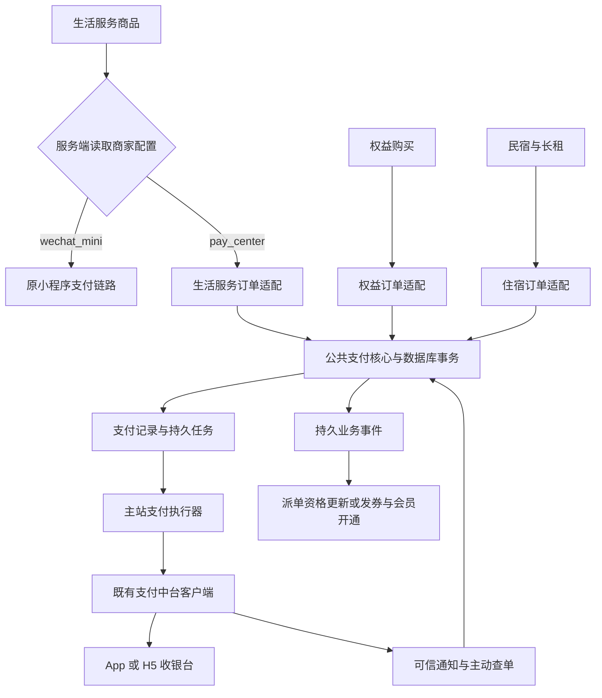

# 新居住权益中心与生活服务统一收银台接入设计

日期：2026-10-02

状态：代码已实施，隔离数据库与假网关联调验收见文末。尚未部署，未执行真实资金交易。

适用范围：当前 `/proweb/run/sy` 的住宿支付、生活服务及权益中心。

本方案复用民宿、长租预订的支付中台客户端和收银台唤起逻辑，增加生活服务与权益订单适配。支付历史表允许同一业务订单有多次支付尝试，但必须串行控制有效尝试，重试复用原支付单，支付成功后只履约一次。

## 已确认的设计约束

1. 支付及退款记录通过 `biz_type + biz_order_no` 关联业务订单；这两个字段在支付历史表中的联合索引保持非唯一。
2. `payment_orders.biz_order_no`、`payment_refunds.biz_order_no` 保持 `VARCHAR(32)`，不扩容。权益 UUID 在支付适配层无损压缩为 32 位，原业务主键不变。
3. 生活服务根据商家配置决定跳转小程序支付，或使用本站中台支付和收银台；不按品类统一切换，不增加商品级支付模式覆盖。
4. 必须实现请求、支付尝试、回调、履约和退款幂等，防止重复支付和重复发券。按钮防连点仅改善体验，不作为资金保护措施。
5. 民宿、长租、生活服务、会员及券均保留原接口定义，包括已有路径、参数含义、返回包装和金额单位；通过兼容层接入公共支付核心，不按品类维护不同支付副本。历史模拟支付成功行为不作为真实到账依据。

下文保留设计依据，文末记录实际落地与验收。中台外部契约尚未取得的部分仍需上线前验证，不将本地测试等同于生产能力验证。

## 改造前现状及复用边界

| 模块 | 源码现状 | 本次处理 |
|---|---|---|
| [支付客户端](../../server/thirdApi/payCenter.cjs) 与 [网关客户端](../../server/utils/gateway-client.cjs) | 已封装支付创建、查询、关闭及退款接口 | 复用协议、鉴权及错误封装，核对外部幂等和终态契约 |
| [支付服务](../../payment_service.cjs) | 硬编码 `booking_orders`、住宿描述、单商户收款及整单退款 | 抽出公共核心与业务适配，修正通知和状态推进缺口 |
| [住宿收银台](../../lvju-app-booking.html) | 已有 App JSBridge 唤起及 H5 跳转 | 抽取公共收银台组件，统一静态页与 React 入口 |
| [生活服务路由](../../server/routes/jiazheng.cjs) | 新详情外跳；旧支付接口直接写 `paid`；旧建单信任前端 `fee` | 商家分流、后端定价、真实支付、订单归属及档期预占 |
| [权益路由](../../commerce/app.cjs) 与 [业务服务](../../commerce/service.cjs) | 真实 `/orders` 关闭；内部已有预占、发券和会员处理 | 接入真实订单、支付与可重试发券，补单品购买 |
| [权益结算](../../commerce/settlement.cjs) | 已有逐券退款、账务和结算状态，机构执行仍为沙箱 | 退款关联原支付并接真实通道；收款接通不等于结算、代发已完成 |
| [主订单中心](../../gr_orders.cjs) 与 [权益投影](../../commerce/main-system.cjs) | 列表排除 `pending`；权益仅发券后插入主订单，同号不更新 | 展示中台待支付订单，增加续付和有状态约束的幂等同步 |

以下既有缺口纳入公共支付核心改造：通知入口缺完整可信来源和业务快照核验；通知先记 `processing` 后失败时可能被重复判定吞掉；同笔成功在业务已确认后可能被误判为迟到支付；取消、退款记录与补偿任务存在分事务空窗。不能原样复制这些分支。

## 总体结构与进程边界



本期采用同一 MySQL 数据库中的事务与持久任务，不新建支付微服务：

- 主站 `app.js` 与独立的 `commerce/app.cjs` 都可调用公共模块完成支付意图落库；`createIntent` 仅操作数据库，不请求中台。
- 主站支付执行器统一消费网关任务，复用已有支付配置和客户端；commerce 进程不额外加载网关凭据。
- 支付结果与业务事件在同一事务落库。主站和 commerce 各自消费自己的业务事件，失败后可恢复。
- 商业订单、预占库存与支付控制记录在创建订单的同一事务注册。首个支付意图可同时创建，也可在用户点击支付时创建；第二种情况下订单必须可查询、续付和正常过期。
- 共享库和表的迁移由统一版本管理负责，commerce 启动检查所需版本，不由两个进程各自抢跑相同 DDL。

部署前必须核验主站数据库与 `COMMERCE_DB_NAME` 指向同一库。当前 commerce 支持配置独立库，源码不能证明实际部署同库；若不同库，本方案的同事务保证不成立，需要另补可信内部接口和跨库事件协议后再实施该部分。

## 业务标识与订单号不扩容

### 标识约定

| `biz_type` | 原业务标识 | 支付表的 `biz_order_no` |
|---|---|---|
| `booking` | `booking_orders.order_no` | 原值，保持现有格式 |
| `jiazheng` | `jz_orders.id`，当前付费订单为 `WO-…` | 原值，服务端校验不超过 32 位 |
| `commerce` | `commerce_orders.id`，标准 UUID | 校验后转小写并去掉四个连字符，恰好 32 位 |

权益业务表、对外接口、页面链接、卡券和主订单中心继续使用完整 UUID。例如：

```text
业务订单：12345678-1234-4abc-8def-123456789abc
支付标识：commerce + 1234567812344abc8def123456789abc
还原格式：8-4-4-4-12
```

只有 commerce 适配器进行 UUID 转换，不对任意字符串直接删字符。禁止截断、重新随机生成或哈希替代业务号。所有入口统一调用 `normalizeBizOrderNo` / `restoreBizOrderNo`，并根据可信业务记录取得最终标识，避免同单出现多种表达。

`app_order_id` 继续使用现有 `XD_时间戳_随机数`，退款使用既有退款流水格式，均保持现有字段长度。支付流水与业务订单号职责不同；本地唯一键冲突仅可在尚未对外提交的创建事务中重新生成。请求发出后任何重试均不得换流水号。

旧生活工单中可能存在权益售后 UUID；这些 `not_required` 工单不进入付费入口。对历史或新增超长的非标准付费订单号明确拒绝并记录待适配项，不能静默裁剪。

## 商家级支付方式配置

### 配置与分流

`jz_vendors` 新增 `payment_mode VARCHAR(16) NULL` 和 `payment_config_version`。配置只允许两种有效模式；空值表示未完成支付开通，不是第三种支付渠道。

| 配置 | 服务端行为 | 开通校验 |
|---|---|---|
| `wechat_mini` | 使用现有 `wechat-link`、商家签名及小程序支付流程 | URL Link 接口、签名配置及商家状态有效 |
| `pay_center` | 创建本站订单和支付意图，返回中台收银台 | 收款商户号、应用及业务配置、商家状态有效 |
| `NULL` | 不开放付费交易，返回明确的未开通提示 | 不自动推断为中台支付 |

商品归属商家由后端查询 `jz_products.vendor_id`，前端传入的商家号、支付模式、收款金额不作为可信依据。商品展示接口只返回允许公开的支付能力；小程序密钥、网关配置和收款配置不直接下发。

- 新订单依据当前商家配置选择渠道，并保存模式、版本、商家和收款配置快照。存量小程序商家在迁移时显式归入 `wechat_mini`；有 URL 但缺必要配置者保持原渠道并修复配置，不自动切换收款方。
- 商家切换模式仅作用于新订单。老订单续付、查单、退款与订单详情使用下单快照；凭据轮换可使用对应配置的有效凭据，不改变收款主体和渠道。
- 小程序请求失败、超时或用户返回，不触发自动改走中台。若要更换交易渠道，应先处理原渠道订单，按明确的新订单流程操作。
- 免费领取、咨询和无需支付售后按业务规则处理，不生成正金额支付单；商品是否收费与商家的支付模式是两件事。

### 配置入口与写入边界

平台商家接入配置台增加模式与收款商户配置、条件必填和变更审计。沿用现有配置管理权限；商家自助接入接口不能仅凭现有 URL 修改权限更换收款主体。各端文案调整为“小程序模式需配置 URL Link”。

现有 `vendor_config.cjs` 仅加载具有 HMAC key 的商家，不能直接用作中台商家的支付配置来源。支付配置使用独立查询，HMAC 只在小程序分支校验。创建新订单时事务内读取当前配置；展示缓存带版本并在配置变更后失效，覆盖主站和 commerce 进程。

必须同时封闭后端旁路：

- `wechat-link` 拒绝新建中台模式订单，中台下单接口拒绝小程序模式订单。
- 商家支付回调核验签名商家与订单归属，只能推进原小程序订单允许的状态；不得修改中台订单的金额或支付状态。
- 中台支付状态仅由支付核心依据可信中台结果推进。履约回调不能覆盖支付事实。
- 订单详情及 `vendor-detail` 接口按订单模式快照分流，不能仅靠前端隐藏第三方入口。
- 旧免费报修取消接口不能仅凭手机号、来源和 `pending` 硬删除订单。只允许明确 `not_required` 且不存在支付控制记录/支付尝试的报修单按免支付规则取消；其余订单统一进入 guard 关闭及退款流程，保留订单记录。

## 数据模型

### 支付历史与唯一业务控制记录

`payment_orders` 表记录每一次支付尝试，保留非唯一业务索引；新增 `payment_order_guards` 表，每个业务订单只有一条控制记录，用于并发串行化。这两个约束作用在不同对象上，不冲突。

以下为约束示意，不是可直接执行的迁移脚本：

```sql
-- 历史尝试表：一笔业务订单允许有多条支付记录。
KEY idx_po_biz_id (biz_type, biz_order_no, id),
KEY idx_po_biz_status (biz_type, biz_order_no, pay_status),
UNIQUE KEY uk_po_app_order (app_order_id)

-- 控制表：同一业务订单只有一条仲裁记录。
PRIMARY KEY (biz_type, biz_order_no)

-- 退款表：同一原支付允许多次合法部分退款；每个退款请求唯一。
KEY idx_pr_biz_order (biz_type, biz_order_no),
KEY idx_pr_payment (payment_order_id),
UNIQUE KEY uk_pr_app_order (app_order_id),
UNIQUE KEY uk_pr_idempotency (idempotency_key)
```

### 字段与新增结构

| 表 | 调整及职责 |
|---|---|
| `payment_orders` | 增加 `biz_type`、应用/项目配置快照、配置版本；保留 32 位业务号、原支付流水唯一键、现有收款方及付款人快照 |
| `payment_refunds` | 增加 `biz_type`、退款业务引用；保持原支付关联和原流水唯一键，支持明确金额的多次部分退款 |
| `payment_order_guards` | 复合主键；包含账号、金额分、支付渠道、配置快照、付款截止时间、`active_payment_id`、`paid_payment_id`、生命周期、版本和时间戳 |
| `payment_requests` | 唯一键 `(actor_id, operation, request_key)`；保存规范化请求摘要、业务标识和对应支付记录，处理 API 重试与同键异参 |
| `payment_jobs` | 唯一逻辑任务键；保存支付创建/查询/关闭、退款创建/查询任务、目标记录、重试时间、租约及租约代次。外调始终在事务外 |
| `payment_events` | 唯一事件键、业务标识、目标消费者、版本、载荷、处理状态和重试租约；作为可恢复的业务事件队列 |
| `payment_notify_log` | 保留通知唯一摘要；补充可重试状态、错误摘要和处理租约，只有处理完成的通知才可直接返回重复成功 |

guard 生命周期为 `open / closing / closed / paid`。`paid_payment_id` 是被业务接受的成功支付，退款后也不清空；原订单退款完毕不重新开放支付。未被业务接受的迟到或重复到账仍记录在支付表，并分别退款。

生活服务订单补充可信账号、商品、商家、城市、价格版本、渠道和配置快照、支付期限、支付/退款摘要、订单请求幂等标识。权益订单补充支付关联与履约状态；主订单投影补充业务类型和模式快照。

所有业务计算使用整数分并校验安全整数及数据库金额上限。网关边界才转为两位小数元字符串，不使用浮点累计；支付表原 `DECIMAL` 字段保留。配置快照只存业务参数及凭据引用，不保存密钥副本。

## 幂等与防重复支付

### 五层保护

| 层次 | 机制 | 解决的问题 |
|---|---|---|
| 业务建单 | 登录账号、操作和业务请求幂等键唯一；同键异参返回 409 | 双击提交不能生成两笔业务订单并各自收费 |
| 支付请求 | `payment_requests` 唯一键，重复请求映射到原支付尝试 | HTTP 重试、页面刷新、响应丢失 |
| 业务订单并发 | guard 唯一业务键与 `SELECT ... FOR UPDATE` | 即使换请求幂等键，同单也不能同时创建两笔有效尝试 |
| 网关请求 | 中台认可的稳定 `app_order_id` 幂等键 | 已发请求但本地未收结果时，避免重新扣款 |
| 结果与履约 | 支付状态单向推进、有效支付唯一、事件唯一、发券/派单/退款幂等 | 重复通知、主动查单与回调并发、重启后重复消费 |

本地设计保证不主动为同一订单并行开放多个付款尝试。端到端防重复扣款还依赖中台的下单幂等及关单终态契约；租约或本地唯一键不能替代外部保证。若仍收到不同尝试均成功的结果，只接受一笔有效收款，其余按原单退款，并保留异常记录。

### guard 注册及统一锁顺序

guard 由经过归属、金额、支付资格校验的业务适配器创建，不能接受客户端任意构造的订单。注册使用原子插入与主键冲突复用；冲突后锁定原记录并比较快照，禁止覆盖已有金额、账号或收款信息。

统一锁顺序：`guard → 业务订单（需要时）→ payment_orders 按 ID → payment_refunds 按 ID → 库存/档期按稳定键排序`。所有支付入口、取消、结果处理、退款和业务消费者遵循此顺序，禁止业务入口先锁订单、回调反向先锁 guard。首次建单事务可插入尚不可见的新订单和 guard，提交前其他事务不可消费。

请求幂等记录在入口事务中先认领；后续处理不反向获取其他请求的锁。任务执行器认领租约后提交，再进入 guard 事务；不持有任务锁等待业务锁。短暂死锁可整体重试数据库事务，网关 HTTP 调用不能放入自动重试的事务函数。

### 创建或复用支付意图

```text
认证用户，校验输入，规范化业务标识
事务开始
  原子认领请求幂等键；同键异参则拒绝
  锁 guard，按固定顺序校验业务订单
  读取此请求已有的支付映射；已绑定的映射永不替换
  若 guard 已 paid：保存本请求的结果或首次绑定有效支付，返回订单已支付，不给拉起地址
  若 guard closing/closed 或已到期：保存结果，禁止创建和拉起；已映射请求只返回受限状态
  若此请求已有映射：返回原尝试经 guard 裁决的当前状态，不重新创建
  若 active_payment_id 非空：将本请求绑定该尝试，返回可复用状态或处理中，不建新号
  否则创建 payment_orders(creating)，生成一次 app_order_id
  绑定 active_payment_id；写唯一创建任务和请求映射
事务提交
返回支付记录；待执行器得到收银台地址后供前端查询/拉起
```

所有复用与首次已付返回分支都要持久保存请求结果/支付映射，不能只在新建尝试时保存。例如请求 B 首次复用 P1 后，即使 P1 已关闭，B 重试也不能创建 P2；用户明确开始下一次尝试时才使用新的操作键，并再次经过 guard 仲裁。

同一请求重试返回原尝试的当前状态，而非缓存过期的收银台 URL。响应区分订单总体支付状态与本次尝试状态；取消、过期、已有有效支付或处理中时，幂等重放、状态查询均不能返回可再次拉起的地址。客户端即使曾缓存 URL，也仍由中台关单及晚到退款机制收敛风险。订单首次创建同样需要幂等；支付幂等不能防止用户重复建成不同的业务订单。

### 支付状态与是否允许重开

| 尝试状态 | 占用 active | 重复发起的处理 |
|---|---|---|
| `creating` | 是 | 返回处理中，等待唯一创建任务 |
| `paying` | 是 | 收银台仍有效且终端适配时复用；否则请求关闭旧单 |
| `create_unknown` | 是 | 查原流水，不换号 |
| `closing / close_unknown` | 是 | 返回关闭处理中，禁止新建 |
| `pay_failed` | 默认仍占用 | 仅中台明确为不可再成功的终态时，按终态关闭规则解除占用 |
| `closed` | 否，须条件清理 | guard 仍 open、未过期且不存在未决旧任务时，允许新的用户支付尝试 |
| `paid` | 阻止继续支付 | 记录有效支付，停止新尝试；业务已取消/过期则转迟到退款 |

关闭旧尝试时只能在 `active_payment_id = 该尝试 ID` 的条件下清理指针，防止旧任务清掉新尝试。HTTP 200、关闭请求受理、查询无订单、重试次数耗尽、租约过期或人工介入均不等于关闭终态。

换 App/H5 终端、收银台过期或者商家修改配置都不能绕过 active。需要换收银台时先确认原单关闭；原订单继续使用创建时的渠道及配置快照。

区分尝试关闭与业务取消：更换过期收银台只关闭旧尝试，guard 在订单仍可支付时保持 `open`；取消订单或业务到期将 guard 推进到 `closing → closed`，不会重新开放。已接受有效支付的订单取消走退款，保留 `paid_payment_id`，不能回到未付状态。

### 中台创建与关闭交错

创建任务领取后，在 guard 锁下复核订单可支付性并持久记录外调阶段，提交后才请求中台。若响应超时或工作进程崩溃，该尝试进入结果未知，新执行器先查原 `app_order_id`。

特别处理“创建请求仍在途，关单查询暂时无记录”的情况：此时不能释放库存或创建新支付尝试，因为原请求可能稍后创建成功。停止新创建任务、保留 active，继续用原号查询/关闭。只有满足中台认可的不可再成功终态，以及未决创建任务已得到处理，才能解除占用。

重发原创建请求仅在中台明确支持同号同参幂等时进行；请求内容使用首次快照。关闭后的订单不会因迟到的创建响应恢复为可支付。租约代次约束任务调度写回；已核验的成功支付事实仍交统一状态推进器处理，不能因任务租约失效而丢弃到账事实。

### 成功、重复成功与通知恢复

通知通过验签或双方确认的可信来源机制后，还需核验应用、项目、原流水、金额、币种和收款方。中台通知缺少必要字段时，用服务端主动查单补齐可信证据；路径 token 不作为完整验证。

在 guard 事务中处理成功：

1. 先识别本笔支付是否已经处理。相同有效支付的重复成功直接幂等返回，不因业务已确认、已完成或已退款再次退款。
2. 符合订单支付时效与取消规则，且尚无有效支付时，锁定 `paid_payment_id`，写唯一支付成功事件；关闭其余尚未完成的尝试。
3. 已有另一笔有效支付时，本笔记真实到账，创建 `duplicate_pay:<payment_id>` 唯一退款请求，不再次发券或派单。
4. guard 已进入取消/到期关闭或库存已释放时，本笔记真实到账，创建 `late_pay:<payment_id>` 唯一退款请求，不恢复原订单。
5. 支付记录、guard、退款记录及所需任务/事件在同一事务提交，防止显示退款中却没有退款任务。

每笔真实到账，无论正常、多付或迟到，都产生以支付 ID 为唯一键的资金到账事件；只有被业务接受且允许履约的支付才能产生履约任务。事件带业务版本，乱序消费者不能用旧关闭事件覆盖已接受的支付事实。

本期保守时效规则：超过 guard 的付款截止时间且尚未被核心接受的成功，不自动发权益；先保留到账事实并进入原路退款。按期付款但通知迟到的体验，可在取得可信中台成交时间及库存保证后单独扩展，不默认为当前已支持。

通知日志只有 `processed` 才直接返回已处理；`processing / failed` 支持租约超时接管。业务推进和通知完成标记尽量同事务；即使完成标记前崩溃，再执行也由支付和事件唯一约束保证幂等。对外应答内容按中台认可的 ACK 协议统一，不自行假定任意 `REPEATED` 文本均会停止重试。

## 生活服务业务适配

### 建单和履约

中台模式采用明确的 `product_id`，不继续混用频道 SPU 的 `sku_id`。服务端确认商品在架、商家有效、价格版本和服务范围，并计算应付金额，取消接受前端金额覆盖。

订单、账号归属、商家配置快照、业务幂等记录、档期预占及 guard 同事务写入。需要档期的商品在下单时预占，支付确认后转为正式占用；未付过期必须先完成支付关闭判定，再释放档期。无需档期的商品不强行套用预约库存。

支付成功只使订单具备派单资格，服务完成继续由原业务流程决定。将旧 `/orders/:id/pay` 改为真实创建/复用支付意图，彻底移除客户端或普通业务接口直接写 `paid` 的能力。

### 主订单中心与存量数据

下单时建立 `gr_orders` 关联，展示内部待付款订单。修改现有一律排除 `pending` 的条件：保留外跳小程序尚未形成交易的草稿隐藏策略，展示中台待支付订单。详情页使用本站支付状态和履约信息，并提供续付、取消及退款进度。

旧 `jz_orders` 缺少可靠账号、商品和商家快照，且历史 `paid` 可能来自模拟支付。新增列允许旧数据为空；没有真实支付凭证且无法可靠回填的历史单不自动变为可补付、可退款订单，不按手机号自动认领，不补发权益。需要交易时重新校验和报价建新单。

## 权益中心业务适配

### 购买与发券

- 将真实 `/orders` 接入服务端开关和真实支付流程，前台演示购买保持独立。真实入口拒绝 `is_demo` 商品。
- 单品、券包、会员分别建立已发布商品快照；校验用户确认的版本。当前单品还需补报价分配规则绑定，不能沿用演示零规则；核销需要有效规则快照。
- 权益预占、业务订单与 guard 同事务创建，使用同一 UTC 截止时间，沿用现有预占期限口径。
- 支付状态与发券状态分开：`paid + fulfillment_pending` 可重试发券，不能重新收费。复用现有 `(item_id, unit_no)` 发券唯一约束及会员订单唯一约束。
- 消费者锁 guard 后锁权益订单，核验支付事件与订单金额、归属、版本及当前状态。发券、会员、库存、账务、主订单投影与事件完成标记同事务提交，失败整体回滚并重试。
- 已接受支付的订单不再被普通预占过期任务释放；`fulfillPaidOrder` 不再仅因当前时间超过原预占期限拒绝已核验的有效支付，要依据被核心接受的支付事实执行。

### 已收款待发券的账务

当前资金入账发生在 `fulfillPaidOrder` 内，改造后不能因发券失败而漏记已收款。权益资金事件消费者先独立事务按支付 ID 幂等登记收款及待履约负债，并在同事务登记后续履约任务；发券事务将待履约负债转为已发券的未核销负债，不重复登记收款。

迟到或多付的资金记录待退款负债，实际退款成功后冲回对应负债。资金事件未消费时，中台与 `payment_orders` 对账明确展示“已到账待入账”，持续重试并告警，不能显示为未支付。账务不变量需覆盖已付款待发券、已发未核销、已核销及已退金额，不能只扫描 `fulfilled` 订单。

### 到期与资金模式

现有 `expire()` 不能继续仅凭 `reserved + expires_at` 直接释放库存。改为获取 guard 后请求关闭：有未决支付时保留预占；确认不存在可能成功的尝试后，再由幂等业务事件释放库存、标记过期。长期未知进入告警和原单核查，不以超时为由盲目释放或换号。

权益多商户券包不能取第一个商户作为收款方。需明确以下一种经过支付侧验证的模式：权益销售主体统一收款并按核销结算，或具备相应能力的多商户收款/分账。配置中保留明确的权益收款主体，不从某个履约商家推断。

即使是单商户权益，也要让实际资金流与账务一致：不能照搬住宿将全款直接付给履约商家，同时保留权益的商户应付和后续再次代发。权益配置需明确收款/结算模式，并相应适配收款、负债、核销结算和退款账务；收款主体未明确的单品、券包与会员均不开放真钱交易。

在收款和部分退款契约未确认前，可先完成代码及沙箱验收；真实试点只开放已验证收款关系的商品。多商户包的核销后结算、推广佣金代发与本次收银台共用基础数据，但不能随收款开关一并宣称上线。

## 退款与对账

住宿继续支持原有整单退款规则；权益支持按券分摊金额的多次部分退款。生活服务按其取消和退款政策计算可退金额，不直接套用住宿取消时间。

每个退款请求具有唯一幂等键，例如 `commerce_case:<case_id>`；自动迟到/重复到账退款以支付 ID 为键。创建退款时锁定原支付，在同一事务内校验：

```text
已成功退款金额 + 处理中及结果未知的退款预占金额 + 本次金额 <= 原实付金额
```

退款失败只有在中台确认不会继续成功时才释放退款额度。退款下单、查单、重试均复用同一个退款流水；结果未知不换号、不再次占款。部分退款成功不能把整笔业务支付直接标成全额已退。

权益逐券退款还需锁定券并与核销互斥，建立 `commerce_refund_orders → payment_refunds → 原 payment_orders` 关联；真实回执成功后才关闭售后、更新账务和退款进度。保留现有沙箱适配供测试，但真钱订单不能消费沙箱成功回执。

迟到支付可能尚未发券，自动退款应直接关联原支付和业务订单，不依赖必须存在的券或售后单。支付成功后发券长期失败，可按已确认未履约事实执行原路退款，退款与补发必须互斥。

对账至少覆盖业务单、支付尝试、中台原流水、退款及权益履约结果。记录“有到账无业务履约”“多笔成功”“退款未知”“库存关闭待处理”等异常，支持按原单追溯。日志输出脱敏参数，不记录凭据和完整敏感身份信息。

## 接口与前端契约

以下为拟新增/调整的接口契约；业务接口保留各自认证和归属校验，统一响应结构。

| 接口 | 行为 |
|---|---|
| `POST /api/juzhu/booking/pay` | 保留旧入口；新版提交请求键，旧版缺键时由服务端按账号、订单、终端及已确认关闭的尝试代次生成稳定键 |
| `POST /api/juzhu/jiazheng/orders` | 根据商品商家模式校验；本站模式真实建单。新版提交业务幂等键，旧版缺键由服务端按账号、预约内容和终态代次生成稳定键 |
| `POST /api/juzhu/jiazheng/orders/:id/pay` | 创建或复用支付意图，禁止直接标记已付 |
| `POST /api/juzhu/jiazheng/wechat-link` | 保留小程序链路，增加商家模式校验；可识别的重试复用原引用。旧匿名商品请求保持可用，每次生成独立引用，不声称具有请求级幂等 |
| `POST /api/commerce/v1/orders` | 真实权益预占建单，复用现有业务请求幂等机制 |
| `POST /api/commerce/v1/orders/:id/pay` | 仅校验本人订单并落库支付意图，不在 commerce 进程直接请求网关 |
| 各业务支付状态查询入口 | 返回本人订单的当前支付和履约状态；必要时调度原单查询，不暴露中台响应原文 |
| 既有取消接口 | 写取消/关闭意图；未决状态返回 202，不提前表示已退款或已释放库存 |

新版创建支付请求接受业务订单标识、`cashier_type` 和 `Idempotency-Key`；金额、账号、商户、渠道、应用配置从服务端获取。住宿兼容入口保留手机号参数；生活服务兼容入口保留可选的 `pay_method`，仅作为客户端偏好。两者均接受旧客户端未提供请求键的调用，归属仍以登录账号为准。

统一响应建议：

```json
{
  "biz_type": "commerce",
  "order_id": "12345678-1234-4abc-8def-123456789abc",
  "payment_id": "示例本地支付ID",
  "app_order_id": "示例中台幂等流水",
  "order_pay_status": "unpaid",
  "pay_status": "creating",
  "fulfillment_status": "not_started",
  "cashier_type": "2",
  "cashier_url": null,
  "idempotent_replay": false,
  "next_action": "poll"
}
```

新版生活服务支付处理中返回 202，可拉起收银台或已完成返回 200；权益支付意图入口保留 202 与 `{data}` 包装。同幂等键异参、渠道不匹配或不可支付返回明确业务错误。旧住宿和生活服务缺键支付请求保留 200 及旧响应字段，尽量在同一请求内取得收银台；未知结果仍返回处理中，不能伪造地址或另建支付。新版前端持有同一次操作的请求键，刷新后通过业务订单查找原尝试，不能把每次轮询当新支付请求。

公共 `openCashier` 复用静态住宿页的 App `getSchemeLink + callAndBack` 和 H5 跳转逻辑。取消回调显示取消并恢复操作；任何“支付成功”客户端回调均只触发服务端查单。无 `cashier_url` 且状态非成功时展示确认中，不进入成功页。

用户返回、页面恢复可见时查询状态；短轮询结束仍未明确，则展示处理中及订单入口，后台继续补偿。权益显示“已付款，权益发放中”和“权益已到账”两种结果；生活服务显示真实待付款、已付款待派单等状态。

## 迁移与发布顺序

1. 追加版本化迁移，保留原字段长度和历史迁移校验和。新增列、表和非唯一业务索引，存量支付/退款回填 `biz_type=booking`；迁移异常明确失败，不能一律吞掉。
2. 在短暂禁止新建支付的窗口核对存量：每业务订单的成功支付、未决尝试和退款。初始化 guard；发现多笔未决或成功时记录冲突并核查，不任意选择最后一条，不覆盖历史流水。
3. 对可验证的历史付款从业务表及原支付快照恢复有效支付关联；取消/过期单初始化为关闭。旧模拟生活订单不纳入真实资金迁移。
4. 升级所有支付生产者、通知入口和后台任务，再启用新业务写入。旧补偿任务只懂住宿，不能与新业务记录混跑；切换为新执行器后停用旧扫描。
5. 先让住宿通过公共核心完成回归，再按商家开启生活服务中台支付。已有小程序商家保持原配置；双向渠道隔离同步上线。
6. 权益先验证单品、券包、会员的沙箱购买、发券与退款，收款关系和逆向流程验证后按商品范围放开真实交易。
7. 回退通过关闭新建支付入口或新业务开关控制。已存在支付仍由兼容的通知、查单、退款和履约消费者处理；不删支付历史，不回滚成不认识新业务的后台程序。

存量 `gr_orders` 的业务类型与模式快照根据历史创建链路、可信回调记录和业务表关联回填；权益订单通过 `commerce_orders` 关联识别。不能根据商家当前模式推断老单，无法可靠确定来源者保留只读核查状态。该回填应先于商家模式切换生效。

商家暂停收款或商品下架是否影响尚未发起支付的旧订单，应由业务取消流程明确处理，不能偷偷更换收款方。紧急停止可禁止创建及拉起新收银台，同时继续收敛已经发出的支付和退款。

## 实施文件清单

| 文件或目录 | 计划改动 |
|---|---|
| `payment_service.cjs` | 抽公共核心，保留住宿兼容导出，统一成功/关闭/退款处理 |
| `server/payment/`（新增） | 业务标识转换、guard、请求幂等、任务与事件、业务适配及状态推进 |
| `server/schema.cjs` | 追加共享支付结构和生活服务订单、商家配置迁移 |
| `server/routes/booking.cjs`、`app.js` | 兼容接口、通知认证、执行器和任务切换 |
| `server/routes/jiazheng.cjs` | 商家分流、可信建单、真实支付、归属和档期处理 |
| `server/routes/admin.cjs`、`screens/p-vendor-access.html` | 模式及收款配置管理、校验、审计和文案 |
| `vendor_config.cjs`、`server/routes/api_direct.cjs`、`vendor_api.cjs` | 配置读取、商家自助权限、旧回调和详情接口渠道隔离 |
| `commerce/service.cjs`、`commerce/app.cjs`、`commerce/configuration.cjs` | 真实下单、单品规则、支付意图、过期和发券消费者 |
| `commerce/migrate.cjs`、`commerce/settlement.cjs` | 新版本迁移、原支付退款关联及真实退款适配 |
| `gr_orders.cjs`、`commerce/main-system.cjs` | 待支付可见、订单归属和状态投影幂等更新 |
| 公共收银台 JS（新增）、住宿静态页及 `h5/src/pages/Booking.jsx`、`Paid.jsx` | 统一 App/H5 拉起及结果查询 |
| `juzhu-jiazheng-detail.html`、生活服务支付/订单页、`screens/_jzapi.js` | 按后端模式进入原小程序或本站订单，修正金额展示 |
| `screens/_commerce-customer.js` | 真实购买、续付、到账及退款进度，与演示入口隔离 |

## 验收用例

| 场景 | 必须满足的结果 |
|---|---|
| 同一建单请求并发提交 | 仅一笔业务订单、一份库存预占；同键异参拒绝 |
| 同订单、同请求键并发支付 | 同一支付尝试、同一中台流水 |
| 同订单、不同请求键并发支付 | guard 串行化，仅一个 active；其它请求复用或等待 |
| 请求 B 复用 P1，P1 关闭后 B 重试 | B 仍映射 P1，不自动新建 P2；新尝试须新操作键 |
| 取消/过期后用原请求键重放 | 不返回可拉起的收银台地址，不绕过 guard 状态 |
| 网关已受理，本地响应丢失或进程崩溃 | 仍查原流水，不能另起支付号 |
| 创建请求在途，同时到期关单 | 暂时查无订单不能释放库存或开放新尝试 |
| 收银台过期、App/H5 切换 | 原单未确定关闭前不新建；关闭确认后才允许重开 |
| 重复/乱序通知、通知与查单并发 | 支付事实不回退，资金只接受一次，履约只执行一次 |
| 通知推进失败或完成标记前崩溃 | 可重试恢复，不能永久卡在 processing 或吞通知 |
| 业务已确认/履约完成后重复成功 | 不误触发 late_pay 退款 |
| 不同支付尝试均到账 | 仅一笔有效支付，额外到账按原单唯一退款，不重复发券 |
| 已取消、已过期或库存已释放后到账 | 不恢复业务订单，记录到账并原路退款 |
| 已支付但发券失败，服务重启 | 保持已支付；补发不重复扣款、发券、开会员或入账 |
| 资金到账、发券和关闭事件乱序 | 收款只入账一次，待发券资金可对账，旧事件不能覆盖成功事实 |
| 同原支付并发申请不同券退款 | 已退与退款预占合计不超过实付，核销和退款互斥 |
| 退款请求未知、重复退款回执 | 复用原退款号，不重复占额度或冲回账务 |
| 商家切换模式/修改收款配置 | 新单用新配置，老单沿快照完成原渠道闭环 |
| 伪造前端金额、商家、账号、模式 | 后端拒绝或忽略不可信字段，无越权支付/退款 |
| 商家回调试图标记中台订单已付 | 拒绝资金状态写入，核验商家归属 |
| 付费订单尝试调用免费报修取消接口 | 不得硬删除，必须走关单/退款和库存释放流程 |
| 无 HMAC 的中台商家 | 支付配置可读取；不被小程序配置过滤器排除 |
| 权益 UUID 大小写与往返转换 | 只形成一条 guard；原业务 UUID 和页面链接保持不变 |
| 主订单待付/续付/退款展示 | 本站真实待付可见，小程序草稿策略不被破坏，元分一致 |
| 老模拟订单、演示券与零元售后 | 不产生真实支付、退款或真钱资金回执 |

并发及状态测试在隔离 MySQL 库、可控假网关上运行，覆盖多连接、多执行器、进程崩溃和任务恢复；随后进行中台沙箱契约测试与 App/H5 联调。重点核验成功事实、唯一有效支付、任务可恢复、库存及退款金额守恒。

前期评估已运行四个本地测试文件，共 11 项通过：`gateway_client_test.cjs`、`pay_center_env_test.cjs`、`pay_center_result_test.cjs`、`payment_service_test.cjs`。它们主要覆盖配置、响应校验和工具函数，不能替代上述验收。本次开发只在临时隔离 MySQL 中执行迁移及交易测试，未变更业务环境数据库；不使用通配符运行 `server/test/*.cjs`，其中含会请求真实网关的联调脚本。

## 真实支付启用前需验证的外部契约

| 项目 | 对设计的影响 |
|---|---|
| 中台 `app_order_id` 幂等范围、有效期、同号异参及超时重试规则 | 决定未知请求能否安全原号重发；未确认时只查原单，不换号 |
| 关单与失败终态、查询无订单含义、创建/关闭交错保证 | 决定何时可释放 active、库存并允许新尝试 |
| 通知验签/可信来源、字段、ACK、交易时间及状态码 | 决定成功证据、幂等通知恢复和时效判定 |
| 权益收款主体、业务码、多商户清结算关系 | 决定哪些权益商品能进入真实支付范围 |
| 原支付多次部分退款、累计额度与重复退款契约 | 决定权益逐券退款的正式通道适配 |
| 登录用户范围 | 当前支付要求可信贝壳 UCID；普通手机号用户不能直接套用该能力 |
| 同库部署与主站任务运行方式 | 决定本设计事务边界及跨进程任务的可用性 |

这些项目不影响完成代码和隔离测试，但对应真实资金入口只能在契约验证后开启。本地开发交付不表示外部能力已确认或代码已上线。


## 实施结果

公共核心已落在 `server/payment/core.cjs`，网关任务在 `server/payment/worker.cjs`；原 `payment_service.cjs` 保留为住宿兼容入口。`app.js` 每 2 秒驱动持久任务和住宿、生活服务事件，每 30 秒恢复旧支付及扫描到期订单。commerce 进程消费权益事件、处理发券和会员、排队退款，不持有支付网关执行职责。

| 范围 | 落地行为 |
|---|---|
| 业务关联 | 支付和退款历史仍为 32 位业务号，新增非唯一业务类型联合索引；权益 UUID 在边界无损往返 |
| 并发与重试 | guard 主键串行控制有效支付，请求键始终绑定原尝试；创建结果未知只查原流水；任务租约、运行期间重唤醒和业务事件均可恢复 |
| 可信结果 | 通知仅持久化权威查单任务；新业务成功查单必须核对流水、金额及商户。住宿保留旧中台查询回执兼容，仅在执行器按原流水发起的可信服务端查询中允许省略旧协议未返回的字段，已返回字段必须匹配；直接状态推进和客户端回调不能启用该兼容 |
| 商家分流 | 平台商家配置支持 `wechat_mini` 和 `pay_center`，商品页、建单和回调均校验模式；订单保存原配置，模式切换不改旧单渠道 |
| 生活服务 | 从有效商品读取价格、商家和城市，同事务登记支付并预占档期；本人查单、续付、未付关单及派单前全额退款闭环；免费报修不能删除付费订单 |
| 权益中心 | 单品、券包、会员的真实订单和支付入口；到账先记录资金，随后幂等发券或开通会员；支持未用券原路部分退款，和沙箱回执隔离 |
| 资金核对 | 同一一致性快照核对实际到账、待入账、待发券负债、券池、已核销及真实退款；`I2b` 明确显示未消费资金事件，重复到账分别对账 |
| 库存 | 未付取消等待权威关单，再消费关闭事件释放库存；发券、退款、关单分别保留状态，乱序退款不能吞掉预占释放 |
| 旧住宿 | 优先原支付收款快照，按业务成功指针恢复有效付款；旧晚到到账不升级为有效付款，原退款仅查询；异常历史保持阻断并记录错误 |
| 页面 | 静态页和 React 共用 `screens/_cashier.js`；请求键包含终端类型，只有服务端允许新尝试才换键；返回页面后主动查询 |
| 订单中心 | 本站待付款可见，小程序草稿仍隐藏；同一已验证账号兼容新账号标识和旧 UCID，调用方不能选择其他人的账号订单 |

相对于设计中的可选方案，实际选择如下：业务事件使用 guard 和事件行锁，在同一个短事务内执行业务更新及完成标记，因此没有增加另一套事件租约。通知的 `success` 表示权威查询任务已持久化，真实支付状态由任务推进。任务采用短事务领取加租约令牌，外部调用在事务外；不依赖 `SKIP LOCKED`。旧数据冲突不自动选最新流水、不自动换号重扣、不无证据重发退款。

本期新建的生活服务中台订单保存 `before_dispatch_full_refund` 取消规则：派单前可申请全额原路退款，派单后提示走售后；此规则不改历史小程序订单。权益的收款接入、原路退款已实现，原有机构结算和推广代发的真实通道不在本次收银台改造范围。

## 部署配置与维护

示例变量已补入 [环境模板](../../.env.example)，实际凭据由部署环境注入。

| 配置 | 用途 |
|---|---|
| `PAY_APP_CODE`、`PAY_PROJECT_CODE`、`PAY_SHARE_BIZ_CODE`、`PAY_NOTIFY_URL`、`PAY_NOTIFY_TOKEN`、`OAUTH_*` | 复用现有住宿支付与网关配置；通知地址指向主站 `/api/juzhu/payment/notify/<token>` |
| `PAY_NEW_INTENTS_ENABLED` | 默认启用；设为 `0` 阻断新的支付意图并隐藏查询响应中的收银台地址，已发请求和退款继续收敛；须在两个进程一致注入 |
| `PAY_POLL_SECONDS`、`PAY_JOB_LEASE_SECONDS` | 默认 10 秒查单间隔、60 秒任务租约；实例内防止重叠运行，跨实例由数据库租约控制 |
| `PAY_COMPAT_WAIT_MS` | 旧住宿接口等待其他执行器持有的当前任务完成，默认 3000 毫秒、上限 10000；超时保留原支付和处理中状态，不能重发创建 |
| `PAY_CLOSED_STATUSES` | 默认 `40`，启用真实支付前须确认其不可再付款语义，不能将查询无订单视为关闭 |
| `jz_vendors.payment_mode`、`pay_merchant_no`、`payment_config_json` | 平台管理商家渠道；生活服务可以覆盖该商家的应用、项目、业务码，订单落快照 |
| `COMMERCE_PAY_ENABLED` | 默认 `0`；完整配置且共享库迁移就绪后才可开放真实权益购买 |
| `COMMERCE_COLLECTION_MODE` | 本期只接平台统一收款 `platform` |
| `COMMERCE_PAY_MERCHANT_NO`、`COMMERCE_PAY_APP_CODE`、`COMMERCE_PAY_PROJECT_CODE`、`COMMERCE_PAY_SHARE_BIZ_CODE`、`COMMERCE_PAY_NOTIFY_URL`、`COMMERCE_PAY_CONFIG_VERSION` | 权益独立收款配置，不从商品请求接收收款方或金额 |

发布顺序是先核对两个进程使用的 MySQL 主机、端口、库名和账号权限，备份并排查历史未决流水；在维护窗口运行主站 schema 迁移，确认 `payment_migrations` 中 `20261002_unified_cashier_v1` 和 `20261002_booking_legacy_snapshot_v2` 成功；再运行 commerce 既有迁移入口，追加 `006_cashier`，旧迁移校验和保持不变。主站支付执行器和 commerce 事件消费者都应运行后，再逐商家开启生活服务，并按权益配置开放购买。此处描述发布步骤，本次开发没有执行这些业务环境操作。

遇到事故时先关闭新意图和权益购买开关，保持兼容版本的执行器与事件消费者。开关不会撤回用户已经持有的外部收银台；需要取消已发支付时走逐单关单流程。不得删除任务、清空有效付款指针或回退到只识别住宿的旧补偿程序。

排障以持久状态为准：`payment_jobs.last_error/next_run_at/lease_until` 查看外调任务；`payment_events.status/last_error` 查看履约失败；旧单恢复错误在主站日志中给出业务号和错误码。持续 `create_unknown/close_unknown` 时保持原单占用，先核对网关；退款失败继续保留退款额度预占。日志对凭据、UCID、手机号、回调地址和收银台链接脱敏。

## 开发验收

测试使用 `/tmp` 下单独初始化的 MySQL 实例，禁止读取应用数据库配置，支付网关为可控假实现。每套集成用例创建自己的临时数据库并清理；没有访问真实支付网关，没有修改现行业务数据。

2026-10-02 首轮联合回归结果（住宿、生活服务与会员券的兼容专项补充见后）：

| 验收 | 结果 |
|---|---|
| 公共支付核心 | 19 项通过，包含跨业务同号隔离、并发防重、未知结果、回调竞态、部分退款额度和暂停支付后的补偿 |
| 住宿及公共收银台 | 10 项通过，包含真实路由 6 并发仅一单、库存仅预占一次、旧迟到付款及原退款恢复 |
| 生活服务 | 6 项通过，包含价格及归属、真实 SQL 幂等、档期释放、商家渠道切换后原外跳订单恢复 |
| 权益中心及浏览器 | 11 项通过，包含到账后发券失败恢复、逐券退款、资金守恒、乱序关闭、贝壳会话交换及实际收银台跳转 |
| 网关封装及既有权益回归 | 29 项通过 |
| 主站权限与隐私脚本 | 3 个脚本通过 |
| 语法及构建 | 33 个相关 JS/CJS 文件语法通过，H5 构建及 `git diff --check` 通过 |

四套支付集成统一运行结果为 **46 通过、0 失败、0 跳过**；以上网关与既有权益回归合计 **29 通过、0 失败、0 跳过**。测试数据库实例在验收结束后关闭。

完整支付回归命令如下，其中 `PAYMENT_TEST_SOCKET` 必须显式指向隔离实例。不要用 `server/test/*.cjs` 通配运行，目录内另有真实网关联调脚本。

```bash
PAYMENT_TEST_SOCKET=/tmp/sy-cashier-mysql/mysql.sock node --test \
  server/test/unified_payment_core_test.cjs \
  server/test/booking_payment_adapter_test.cjs \
  server/test/jiazheng_cashier_test.cjs \
  scripts/commerce/payment-integration.test.cjs

node --test server/test/gateway_client_test.cjs \
  server/test/pay_center_env_test.cjs \
  server/test/pay_center_result_test.cjs \
  server/test/payment_service_test.cjs \
  scripts/commerce/domain.test.cjs \
  scripts/commerce/http.test.cjs

node scripts/test_api_auth_gate.js
node scripts/test_juzhu_admin_auth.js
node scripts/test_juzhu_contact_phone.js
npm run h5:build
```

浏览器验收可额外设置 `PAYMENT_TEST_BROWSER=1`，并通过 `COMMERCE_PLAYWRIGHT_MODULE`、`COMMERCE_CHROME` 指向本地测试依赖。用例点击真实权益商品页面，经 HTTP 建单、支付核心、持久任务及假网关落库收银台地址，再实际执行 H5 跳转；不修改接口响应冒充支付成功。

H5 构建通过。构建沿用工作区已有的 Morph 缺包替代配置，并提示部分静态资源和普通外链脚本运行时加载；本次没有修改用户的 Vite 配置或 Morph 替代文件。App JSBridge 使用隔离单元测试验证调用和回调语义，仍需在贝壳真机验证。真实中台成功查单字段、关闭终态、部分退款、商户收款资质及生产回调可达性仍属于上线验收。

## 民宿、长租原链路兼容补充

本节落实“不能让原有民宿、长租接入收银台代码报错”的要求。以改造前 Git HEAD 的静态页面、React 页面和 `payment_service.cjs` 为对照，保留旧请求方式，并增加以下兼容行为。

| 兼容面 | 实施方式 |
|---|---|
| 旧支付请求未传幂等键 | `booking-compat.cjs` 生成稳定请求键。相同代次并发点击共享原支付；只有旧支付被权威确认关闭后才进入下一代。金额和商户仍从原订单快照读取 |
| 旧页面要求即时收银台地址 | 同步驱动当前支付的持久创建任务，与后台执行器共享租约。已有执行器处理时有限等待；不直接再调用创建接口，不执行其他订单的任务。未知结果保留业务 `paying` 状态，便于旧 React 页轮询 |
| 旧查询响应与即时状态 | `result` 保留 `appOrderId/orderStatus/payMethod/payNo` 等字段，顶层附加公共状态；指定历史 `app_order_id` 时结果字段来自同一原尝试。返回前消费该预订的支付事件，旧页面随后 lookup 可读到已付。越权、手机号或流水归属错误仍拒绝 |
| 旧服务公开方法 | 恢复创建/复用支付、查单、创建/请求/查询退款、关单、补偿、状态推进及流水生成方法。旧状态推进入口重新查原单，传入通知体不能作为已付证据 |
| 原 App 与 H5 页面 | React App 按需加载同源 JSBridge；普通 H5 保持网页收银台。支付取消可重试，返回页面重新查单。关闭、退款状态优先于尝试层面的 paid，不把迟到付款显示为预订成功 |
| 存量付款人、商户、应用配置 | 查询和退款沿用原支付快照，不因账号解绑或商户配置变更而改路由。独立 v2 迁移只从匹配原支付号的历史创建请求补齐缺失应用/项目，不修改 v1 校验和、不覆盖已有值 |
| 存量多次尝试 | 当前有效或未决尝试须匹配订单快照；已关闭尝试及已有原路退款的历史额外到账保留各自原付款人和收款方。金额矛盾仍阻断，不自动挑选有效到账 |
| 存量库存与关闭 | 无 guard、无任何支付尝试的匿名到期未付单可在业务锁内复核后释放库存；有付款尝试必须确认关单。不能因为最新尝试已关闭而跳过更早未决尝试；首次登记与过期并发不重复释放 |
| 中台旧回执 | 仅 worker 内按原流水请求的住宿可信查询可以接受旧版稀疏成功回执；任何已回显的订单、金额、商户、应用或付款身份都必须匹配。新业务及直接 reconcile 仍要求完整证据；创建回执和通知本身不能置已付 |

住宿建单继续接受旧版可选的 `idempotency_key`；当前静态页和 React 页均会提交键。无键建单保留旧接口行为，不声称多个无法区分的业务建单请求具有请求级幂等；同一业务订单的支付仍由 guard 防重。

专项测试分别验证真实页面行为、旧 HTTP 路由与隔离数据库、存量迁移、协议兼容。浏览器使用真实静态页和 React 构建产物，但 API 响应为隔离 fixture；后端使用实际路由、MySQL 和假支付网关。二者不能替代真实中台及 App 真机验收。

兼容修复后的验收结果：

| 专项 | 结果 |
|---|---|
| [旧服务与 HTTP 接口](../../server/test/booking_service_compat_test.cjs) | 12/12；双住宿频道无键支付即时 URL、并发单次创建、查单投影、归属校验、退款幂等、旧通知恢复、历史流水与关闭边界 |
| [存量数据与迁移](../../server/test/booking_legacy_data_test.cjs) | 11/11；原付款快照、旧应用恢复、历史多次尝试、旧取消规则、无付款到期释放及并发库存保护 |
| [中台旧协议](../../server/test/payment_gateway_compat_test.cjs) | 9/9；可信稀疏查询、直接推进严格验证、回显冲突拒绝、退款 ID 语义及大整数流水 |
| [实际页面浏览器](../../server/test/booking_cashier_browser_test.cjs) | 12/12；静态/React、App/H5、新旧响应、付款返回、取消重试、退款/关闭展示及 HEAD 缓存旧页 |
| 既有四套支付集成回归 | 46/46；核心 19、住宿 10、生活服务 6、权益 11 |
| 网关与既有权益回归 | 29/29 |
| 其他验证 | 权限与隐私 3 个脚本、兼容相关文件语法、H5 构建及 diff 检查通过 |

四组新增专项合计 **44 通过、0 失败、0 跳过**；连同既有四套支付集成，本轮相关用例合计 **90 通过**。这些套件分别运行，未把父测试与子测试之外的断言另算用例；前述 29 项网关及既有权益回归单独统计。隔离 MySQL 实例完成后关闭，未操作业务数据库或真实资金。

专项复现命令（浏览器依赖路径使用本机实际安装位置）：

```bash
PAYMENT_TEST_SOCKET=/tmp/sy-cashier-mysql/mysql.sock node --test \
  server/test/booking_service_compat_test.cjs \
  server/test/booking_legacy_data_test.cjs

node --test server/test/payment_gateway_compat_test.cjs

npm run h5:build
PAYMENT_BROWSER_MODULE=/path/to/puppeteer-core/lib/cjs/puppeteer/puppeteer-core.js \
PAYMENT_BROWSER_EXECUTABLE=/path/to/chromium \
node --test server/test/booking_cashier_browser_test.cjs
```

## 生活服务与会员券旧接口兼容补充

本节落实“生活服务和会员、券也要兼容旧的接口定义”。对照仓库原有 Node 路由、旧生活服务数据接口及页面调用，保留既有请求和返回约定。会员券以实际运行的 `commerce/app.cjs` 的 M1-A 接口为准；独立 M0 测试服务中的模拟支付接口不开放到正式服务。

### 生活服务请求与返回

以下生活服务路径均以 `/api/juzhu` 为前缀。兼容层为 [jiazheng-compat.cjs](../../server/payment/jiazheng-compat.cjs)，业务处理仍由同一适配器及公共支付核心完成。

| 旧入口 | 保留的定义与兼容处理 |
|---|---|
| `POST /jiazheng/orders` | 接受 `product_id` 或旧 `sku_id`，两者均指 `jz_products.id`，不能把旧 `sku_id` 改解为品类 SKU。继续接受 `house`、`phone`、`expectTime`、`desc`、可选 `fee`；价格以服务端商品为准。无键成功返回 `201 {ok,order}`，`order.fee` 保持分 |
| `POST /jz/orders` | 恢复旧建单入口；保留 `address/house`、`scheduled_at/expectTime`、`desc/product_title`。返回 `201 {ok,order}`，旧 `fee` 保持元，同时提供分单位的 `amount_minor` 和旧展示字段 |
| `GET /jiazheng/orders/:id` | 本人订单返回保留旧平铺字段，同时附加新页面使用的 `.order`；屏蔽收款配置快照及内部请求键 |
| `GET /jz/orders/:id` | 本人查询仍返回平铺订单，保持元单位及地址、预约时间别名；管理与服务者视图保留既有内部口径。外层权限门允许本人会话进入，行级归属检查仍生效 |
| `POST /jiazheng/orders/:id/pay` | 保留可选 `{pay_method}` 及不传幂等键的调用。无键返回 `200 {ok,order,...支付信息}`；同步驱动当前订单的持久任务，只有可信查单及业务事件处理完成才出现业务已付 |
| `GET /jiazheng/orders/:id/payment` | 以本人账号查单，附加最新业务订单；取消、退款状态优先于原支付流水的 `paid`，不能据原流水重新展示付款成功或开放收银台 |
| `POST /jiazheng/wechat-link` | 保留 `{product_id,user_id?}` 及无幂等键调用。登录用户可复用同次订单引用；旧匿名商品请求仍可用，但各次生成独立引用且不写入用户归属 |

无键生活建单按账号、规范化预约内容和已结束订单代次生成稳定请求键。相同未结束预约的重试复用原单，取消、完成或评价后的再次预约可生成新单；代次取匹配终态订单的数量，不依赖随机订单号排序，`done` 转 `rated` 不重复增加。显式幂等键保持原语义，同键异参拒绝，未知结果不换键。该兼容策略不能区分“同一个人刻意提交完全相同的第二份未结束预约”和网络重试；确需两份时由新客户端使用不同的显式请求键。

商家配置仍决定小程序或本站收银台。生成订单后按原渠道快照继续处理，不因商家后续切换而改道；小程序链接失败不能自动转为本站收款。存量未标记渠道的外跳记录，仅在符合原 `GR` 编号、商品及商家记录特征时进入原商家签名回调，继续验证商家归属和签名，不根据商家当前配置猜测历史渠道。

免费工单、他人订单及没有可信归属的旧单不能通过兼容入口付款或认领。旧 `fee` 可继续传入，但不能覆盖服务端价格；旧 `pay_method` 及 App 返回成功也不能作为到账证据。

### 页面方法兼容

`BZF_JZ.pay(id[,payMethod])` 保留旧 Promise 约定，第二个参数省略、为 `undefined`、`null` 或字符串均可。内部调用真实收银台，最终重新读取本人业务订单，确认有效已付后才 resolve；取消、退款或未确认结果不能触发旧页面的成功跳转。新版页面改用 `payIntent` 获取异步支付意图，继续轮询权威状态。

旧 `create(payload)` 未显式带 `idempotency_key` 时保持原无键请求，由后端兼容防重；显式键原样透传。现代预约页保留同次提交的键，不能在仅收到建单成功响应后立即换键；只有明确遇到旧单终态才允许新一代预约。仅带品类 SKU 的旧预约页须解析并确定实际商家商品，多个候选不能静默选错商家。

发布需刷新共享 API 脚本和相关页面资源版本。浏览器专项包含旧 HTML 配合新版共享脚本的验证；完整缓存了旧模拟支付 JavaScript 的客户端不具备新收银台处理能力，不能将保留响应结构等同于这类缓存无需更新。普通 H5 保持网页收银台，App 按需加载同源 JSBridge。

### 会员与券接口

以下路径均以 `/api/commerce/v1` 为前缀。成功响应继续使用 `{data}`，失败使用 `{error,code?}`；品类值继续为 `plans`、`packages`、`skus`，不更名或猜测新增别名。

| 原接口 | 兼容要求 |
|---|---|
| `GET /catalog`、`GET /my`、`GET /my/orders/:id` | 保留商品、会员、券及订单字段。支付迁移新增列仅投影到 `payment_mode=pay_center` 的真实订单；历史与零金额演示单不能因迁移默认值被显示成未支付或未履约 |
| `POST /demo-orders`、`POST /exchange` | 保留原参数、幂等键及演示开关；演示订单继续零资金，不导入真实支付和佣金 |
| `POST /appointments` | 原 `coupon_id`、`service_date` 及 `action=cancel` 保持，预约、改期和取消沿用同一入口 |
| `POST /coupons/:id/token` | 保留动态核销码结构与有效期，由原归属和券状态校验控制 |
| `POST /merchant/redeem/preview`、`POST /merchant/redeem` | 保留预览、确认核销的参数、权限与幂等；支付兼容不能绕过库存及重复核销保护 |
| `POST /cases` | 保留原售后类型及处理流程，退款仍关联原券和原订单 |
| `POST /orders` | 原 M1-A 接口关闭时返回 409 的行为保留；仅显式启用真实购买能力后支持建单。真实购买使用商品版本和服务端价格，不将原演示调用默认为真实扣款 |

会员购买页面保留原商品版本字段，幂等键作用域包含商品版本，避免商品发布后继续命中旧请求内容。退款状态展示优先于已履约，防止退款完成的会员券订单仍显示购买成功。

原结算退款操作仍使用 `POST /admin/settlement/refunds/:id/{execute,query,retry}`。`execute` 保留 `submit`，`query` 保留 `remote_status`、`query_count`、`instrument`，`retry` 保留 `retry_count`、`instrument`；新增真实支付关联字段不替换旧返回包装。退款未由权威结果确认时返回处理中，不能因兼容旧字段提前显示退款成功。

`query` 仅查询已经绑定原路退款的已提交或未知指令，不能替未提交指令发起退款。`retry` 仅允许明确失败、未达到原三次上限的退款，计数在事务锁内增加；查询和重试均复用原公共退款 ID、原支付、金额及幂等键。已取消退款不能执行或重试；演示及旧沙箱退款仍走原有逻辑。

### 本轮兼容验收

会员券 HTTP 专项使用实际 M1-A 服务、隔离 MySQL 和假支付网关；生活服务后端专项使用实际路由和相同隔离方式。浏览器专项使用真实当前页面及 Git HEAD 页面配合隔离 HTTP 响应，覆盖接口形状和页面行为；它不代表真实网关或 App 真机已经验收。

| 专项 | 本轮结果 |
|---|---|
| [生活服务旧路由与真实数据库](../../server/test/jiazheng_legacy_compat_test.cjs) | 16/16；其中 15 个场景及 1 个父测试，包含旧参数及金额单位、无键并发支付、商家分流、已付取消后退款状态、同秒连续取消后重订及外跳代次 |
| [既有生活服务收银台](../../server/test/jiazheng_cashier_test.cjs) | 6/6；定价、归属、支付防重、档期释放、原渠道快照与前端支付请求键回归 |
| [会员券旧 HTTP 接口](../../scripts/commerce/legacy-api-compat.test.cjs) | 8/8；会员与券演示购买、订单查询、预约改期取消、动态码核销、兑换售后、真实支付开关及退款操作 |
| [旧路由与回调边界](../../server/test/legacy_payment_boundary_test.cjs) | 8/8；旧建单分发、本人查询金额单位、旧商家签名回调、退款响应字段与操作类型 |
| [生活服务旧 JS 方法](../../server/test/life_legacy_frontend_test.cjs) | 8/8；无键建单、显式键未知重试、可选支付参数、退款取消优先与 App/H5 返回 |
| [生活与会员券页面](../../server/test/life_commerce_browser_test.cjs) | 9/9；其中 8 个页面场景及 1 个父测试，包含旧 HTML、单商品识别、终态后重新预约、会员券原返回包装、App 桥与商品版本键 |
| [既有权益支付集成](../../scripts/commerce/payment-integration.test.cjs) | 11/11；启用浏览器检查，真实服务经过假网关建单、支付确认、发券与退款 |
| [民宿长租旧服务兼容](../../server/test/booking_service_compat_test.cjs) | 12/12；本轮再次通过，确保兼容补充没有破坏既有住宿服务入口 |
| 既有权益领域与 M0 测试服务 | `domain.test.cjs`、`http.test.cjs` 合计 18/18 |
| 权限与隐私 | `test_api_auth_gate.js`、`test_juzhu_admin_auth.js`、`test_juzhu_contact_phone.js` 三个脚本通过 |

上述套件本轮合计 **96 通过、0 失败、0 跳过**，按 Node 测试报告口径包含父测试，不重复累计同一套件的重跑。三项权限与隐私脚本单独统计。没有修改订单号字段长度、支付历史表非唯一联合索引，也没有访问业务数据库或真实支付网关。

旧页面与旧表结构测试固定使用改造前提交 `f68bdb53f47f6e1e973b26d12e368f07c259f67a`，避免提交后浮动 `HEAD` 将新版代码误当旧版夹具；可用 `PAYMENT_LEGACY_REF` 显式指定其他历史基线。

20 个相关 JS/CJS 文件语法、文档本地链接及 `git diff --check` 均通过。测试临时库已清理，隔离 MySQL 实例已正常关闭；尚未部署。

下列命令仅用于本机隔离实例；浏览器环境变量须指向已有测试依赖。不要改为扫描 `server/test` 全目录，其中包含真实网关联调脚本。

```bash
PAYMENT_TEST_SOCKET=/tmp/sy-cashier-mysql/mysql.sock node --test \
  server/test/jiazheng_legacy_compat_test.cjs \
  server/test/jiazheng_cashier_test.cjs \
  scripts/commerce/legacy-api-compat.test.cjs \
  server/test/booking_service_compat_test.cjs

node --test server/test/legacy_payment_boundary_test.cjs \
  server/test/life_legacy_frontend_test.cjs \
  scripts/commerce/domain.test.cjs scripts/commerce/http.test.cjs

PAYMENT_BROWSER_MODULE=/path/to/puppeteer-core/lib/cjs/puppeteer/puppeteer-core.js \
PAYMENT_BROWSER_EXECUTABLE=/path/to/chromium \
node --test server/test/life_commerce_browser_test.cjs
```
