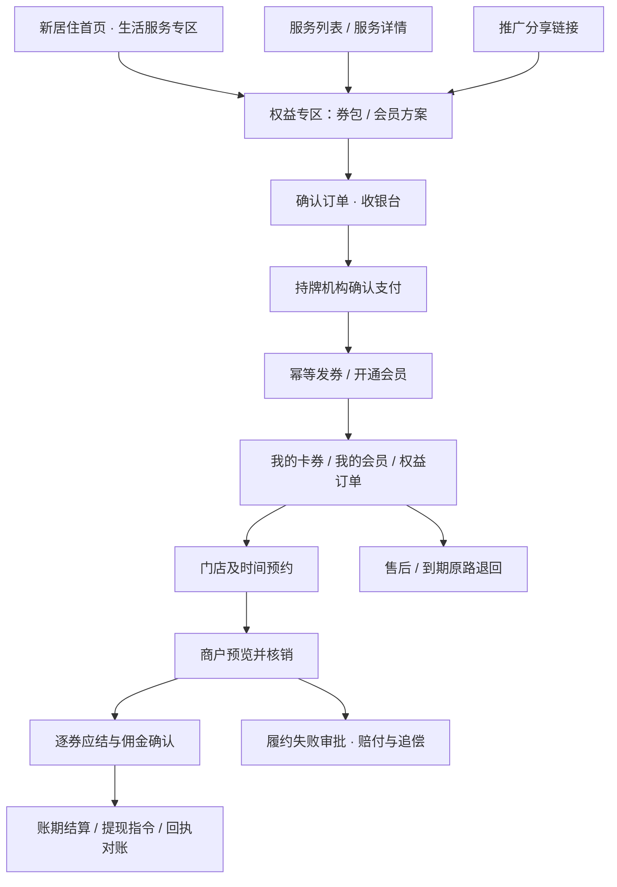

> 2026-09-20阶段更新：运营闭环、结算闭环、运行验收及真实资金试点的当前安排，见 [整体实施计划](ROADMAP-新居住权益运营与结算闭环-20260920.md)。下文保留早期设计与估算，当前实施状态以新计划及验收记录为准。

> 2026-09-19进展：M1-A业务底座与相关管理页面已实现并部署到sytest，正式账号/MySQL/配置双审/库存产能/履约售后通过验收；真实资金链路仍在M1-B范围。详见 [M1-A交付与验证](../verification/newliving-commerce-m1a/README.md)。
>
> 2026-09-20进展：M1-B结算闭环（结算域）已实现并通过专项验收：账期账单/复核执行/回执查单/失败重试/冲回追偿/对账差异/四端视图/金额守恒不变量；机构侧为沙箱镜像，持牌机构实测仍属外部依赖。详见 [结算闭环验收](../verification/newliving-commerce-settlement/README.md)。

# 新居住频道接入券包与会员卡：开发计划

日期：2026-09-19。状态：实施建议，待产品、研发、测试及业务负责人评审。

需求基线：`/root/.openclaw/workspace/98wiki/projects/新居住券包与会员卡/新居住券包与会员卡系统需求与设计文档_v1.9.md`，重点为 §7、§8、§11、§14–18。

实施仓库：`/proweb/run/sy`；基线提交：`a7d6447`；从本地 `cursor` 新建分支：`plan/newliving-coupons-membership-v1.9`。未拉取远端，此处不声称基于远端最新提交。

本文记录完整一期开发计划。用户后续已选择M0无资金联调，并另行实现四端聚合页面与独立内存测试服务，实际交付见 [启动与验收说明](../verification/newliving-commerce/README.md)。下文未来文件、MySQL表、正式接口及工期仍为建议；不得将M0实施等同完整一期。未执行生产数据库迁移或部署。

## 1. 推荐方案与实施边界

把券包和会员卡作为新居住频道的权益交易能力接入：生活服务专区负责发现商品，统一卡券中心承接购买后的使用，商户工作台承接预约与核销，运营财务工作区承接规则、售后、结算与对账。

采用 **现有 Node + MySQL 模块化单体，新增独立 commerce 域**。复用频道外壳、账号中心、城市配置、导航和商户基础资料；券 SKU、订单、库存、券实例、核销、佣金及账务独立建表。家政履约订单通过引用关联，不能兼任券交易订单。

试点口径：沈阳、模式乙、999 元档、首批目标 12 个入驻主体（实际逐家签约准入），自有新居住频道销售。券包与会员卡独立商品，前台先一种会员方案，底层预留多方案。单层推广、一次性赠包、单次核销按建议设计，进入规则评审后冻结。

按三个交付层次推进：

| 层次 | 交付结果 | 可以验证什么 | 放行条件 |
|---|---|---|---|
| M0 无资金联调 | 频道入口、四端流程、独立数据模型及隔离测试数据 | 导航、交互、权限、接口与规则计算 | 明确标记测试；真实收款开关关闭 |
| M1 真实资金试点 | 购买→发券→预约→核销→佣金→结算/提现，以及退款、到期退回、赔付追偿 | 用户是否买、商户是否核销、推广员是否推 | §18 G1–G4 全过；人工兜底落实；支付机构实测通过 |
| M2 一期完善 | 四端 44 页面组补齐、机构渠道完整验收、自动化运营及售后 | 规模化运营与渠道复用 | 完整场景回归、渠道逐项验收 |

“10 页试点”只压缩操作界面，不能删掉资金、权限、预约、退款及对账后端。机构渠道至少一家完成沙箱对接属于一期交付；若赶自有渠道试点，可在 M2 完成，必须记录这项范围调整，不将 M1 宣称为完整一期。

## 2. 当前代码证据与复用判断

以下来自本地静态代码检查，未连接生产数据库或验证外部支付能力。

| 已有位置 | 检查结果 | 接入动作 |
|---|---|---|
| `index.html`：`jzSecCoupon`、`renderJiazhengCoupons()` | 生活服务专区已有领券中心，内容为静态卡片，链接至品类列表 | 替换为服务端可售权益摘要；“全部权益”进入商城；增加我的卡券/会员入口 |
| `juzhu/app.js`、`channel_brand.cjs`、`screens/_region.js` | 有频道品牌及地域公共能力 | 复用展示与跳转参数；城市仅筛选商品，不作为授权凭证 |
| `juzhu-jiazheng-list.html`、`juzhu-jiazheng-detail.html` | 已有服务发现/详情页面 | 增加“相关券包”和本人可用券提示，均由 commerce 接口提供 |
| `screens/_jzapi.js`、`jz_orders` | 家政 REST 工单与券交易职责不同 | 通过履约适配器关联；服务完工不得直接触发券核销或新收款 |
| `gr_orders.cjs`、`juzhu-jiazheng-orders.html` | 现有预约订单按自身模型与 user_id 工作 | 保留原业务入口，新增“权益订单”；不复制其客户端 user_id 作为权益鉴权 |
| `auth_center.cjs`、`idp_oidc.cjs`、`screens/_console-login.js` | 已有账号、会话及身份接入模块 | 复用主体解析；验证宿主用户到平台账号映射；补商户/门店/推广员对象授权 |
| `perm_registry.cjs` | PERMS/ROUTES 是权限与审计单一注册表 | 增加 commerce 权限及全部管理读写路由；对新前缀接入默认拒绝 |
| `app.js`、`juzhu/mysql_schema.sql` | Node 单入口、mysql2、已有 schema 演进 | app.js 只挂载新域；版本化迁移由专用 Node 脚本执行 |
| `jz_vendors`、`vendor_api.cjs`、`hmac_auth.cjs` | 有商户资料、接口签名及既有订单对接 | 显式绑定 commerce 商户；入驻审核、合同、收款账户版本和供应授权新增 |
| `vendor_rate.cjs` | 现有业务线费率能力 | 不作为券佣金默认依据；券规则独立审批并按订单快照锁定 |
| `lvju-app-pay.html`、`jiazheng-payment.html` | 有支付界面与原业务分支，不能证明券清分可用 | 新增权益收银台和支付适配器，不复用演示成功跳转 |
| `screens/_orderbus.js`、`lvju-app-coupons.html` | 有演示工单/券展示素材 | 可参考交互；localStorage 不承载真实券与账务 |
| `screens/_nav.js`、`overview.html`、`lvju-app.css` | 已有导航及视觉体系 | 新页面同提交接入导航，复用品牌样式与正常/空/无权/失败状态 |

原需求 §14.1 的 `bzf/server/src/domain/*.mjs` 不在本仓库实施路径中。旧 `DESIGN-新居住家政服务频道.md` 中 Python/SQLite/API Key 原型部署口径已过时；执行当前 README 和 CLAUDE.md 的 Node + mysql2 规则。

## 3. 接入频道后的用户路径

具体交互约定：

1. 首页保留原频道层级和 12 个生活服务分类，权益区作为转化模块嵌入，不把券包伪装成房源 `channel` 或家政 SKU。城市无可售权益时展示空态；已有券入口仍可访问。
2. 商品详情同时展示实付价、实际服务供应商、销售主体、适用门店、有效期、预约可得性与过期退回说明。999 元仅用于已批准的试点商品配置，不硬编码全站价格。
3. 购买券包不要求先买会员。会员方案独立解释会员期限与赠券期限，支持续费产生新的发放批次，不默认自动续费。
4. 我的卡券按券实例展示；同 SKU 两张券分别预约、核销、退款。详情内提供预约、动态核销码、使用记录与客服入口。
5. 家政服务详情可查询本人适用券，明确服务条件与尾款。新履约关联必须避免原家政付款与券付款重复扣款；尾款如需线上收取，先补独立支付/发票关联契约，未确认前不启用。
6. 原“我的订单”保留家政订单，增加权益订单分类入口。试点采用入口聚合；跨域统一列表后置，禁止为统一列表而混订单表。
7. 推广深链保留商品、渠道和签名归属线索，经登录返回后服务端验证并锁定；手填 promoter_id 不产生佣金归属。未登录可浏览，购买和本人资产必须认证。
8. 宿主扫码、分享、支付逐项检测能力。分享可降级复制安全链接，扫码可降级受限短码输入；支付不支持则明确提示返回支持环境，不能模拟成功。断网不核销。

## 4. 页面实施清单

沿用 v1.9 页面组编号，首轮物理页面可合并多个组；最终须逐组验收，不能以“合并”省略功能。

| 首轮页面/入口（拟新增除注明外） | 对应需求 | M1 交付 |
|---|---|---|
| `index.html` 权益模块（修改）及 `juzhu-commerce.html` | C01 | 可售列表、城市、详情入口 |
| `juzhu-coupon-package.html` | C02 | 逐券供应商、门店、规则与预约可得性 |
| `juzhu-membership.html` | C03/C08 | 会员方案与本人会员状态；续费入口 |
| `juzhu-commerce-checkout.html` | C04 | 服务端报价、条款、商品版本二次确认 |
| `juzhu-commerce-pay.html` | C05 | 机构收银台调用、查单、发券进度 |
| `juzhu-coupons.html` / `juzhu-coupon-detail.html` | C06/C07 | 本人卡券、详情、预约/改期、动态码、客服受理 |
| `juzhu-commerce-orders.html` | C09/C10/C11受理 | 订单及逐券状态、工单编号、售后/开票受理与进度 |
| `juzhu-promoter.html` | Q01–Q09 | 资格状态、推广商品/签名链接、佣金及明细、提现及记录、账户安全入口 |
| `screens/commerce-merchant.html` | B07/B08/B09及预约 | 核销预览/确认/记录、预约处理、应结明细与到账状态 |
| `screens/commerce-admin.html` | A02–A06/A08–A14基础功能 | 经审批配置导入、发布检查、订单补发、售后审批、付款指令、差异与任务处理 |

原文 10 个试点页面组 C02/C04–C07/B07/B08/A09/Q05/Q07 全部覆盖。增加会员、分享、预约、订单售后入口，是验证完整业务所需，不限定为 10 个物理文件。

商户 B01–B06/B10 的自助编辑、平台复杂运营编辑、独立报表和自动发票页面可在 M2 补齐；M1 使用受权操作台与版本化导入，但必须有后端校验、申请/复核、审计和结果查询。不得直接改库完成退款、付款或规则生效。

试点人工兜底在启动会登记具体姓名、时限、替班与升级人：客服负责退款/发票受理（建议 1 个工作日响应，实际办理 SLA 另审批），财务负责每日机构账单核对和双周结算差异清零，运营负责商户资料录入，系统负责人负责权限名单及异常重试。以上是待批准安排，不是已落实承诺。

## 5. 技术拆分与数据模型

拟新增模块目录 `commerce/`，采用 `.cjs`，不引入第二种后端语言，也不先拆微服务。

| 模块 | 职责 |
|---|---|
| `routes.cjs` / `auth.cjs` | `/api/commerce/v1` 路由、身份适配、默认拒绝及对象级授权 |
| `catalog.cjs` / `rules.cjs` | 商户、SKU、券包、会员模板、规则版本、G1–G3 发布校验 |
| `orders.cjs` / `grants.cjs` | 报价、库存预占、支付镜像、资金分配、会员及逐张发券 |
| `appointments.cjs` / `fulfillment.cjs` | 日期产能、预约/改期、家政服务单引用 |
| `redemptions.cjs` / `calculation.cjs` | 核销事务、快照纯计算、冲回 |
| `ledger.cjs` / `settlements.cjs` | 追加式业务账、应结明细、付款批次指令、机构状态镜像 |
| `refunds.cjs` / `compensation.cjs` | 部分退款、到期退回、赔付审批、追偿/保证金引用 |
| `promotions.cjs` / `channels.cjs` | 推广归属、佣金视图、机构采购与分销订单映射 |
| `jobs.cjs` / `reconciliation.cjs` | Inbox/Outbox、查单、到期任务、对账及告警 |
| `adapters/` | 支付/清分、代发、机构渠道、消息、既有履约系统适配 |

前端拟新增 `screens/_commerce-api.js` 统一 API、错误与鉴权处理，`screens/_commerce-bridge.js` 统一宿主能力检测。它们不保存业务余额或生成“支付成功”。

MySQL 新表统一 `commerce_` 前缀，分批迁移：

| 批次 | 表族/实体 | 关键约束 |
|---|---|---|
| D1 主体与商品 | merchants、stores、merchant_bindings、scope_grants、account_versions、contracts；sku_versions、package_versions/items、membership_plan_versions/benefits、rule_versions | 复用账号 ID；旧 vendor 显式映射，不假设 ID 相等；已发布版本不可覆盖 |
| D2 交易及权益 | orders/items、payment_attempts、rule_snapshots、funding_sources、order_allocations、inventory_reservations、membership_instances、grant_batches/items、coupon_instances | 支付流水唯一；发券唯一(batch,item,unit_sequence)；会员与券期限分开 |
| D3 履约及核销 | store_capacity、appointments、capacity_reservations、fulfillment_links、redemption_tokens、redemptions、redemption_settlements | 一次性券有效核销唯一；预约条件更新防超额；核销/退款共享锁 |
| D4 账务及逆向 | ledger_events/entries、commission_entries、settlement_batches/items、payout_instructions、refunds/allocations、compensation_cases、recovery_entries、reconciliation_differences | 追加与原单冲回；不重复付款指令；资金预占发生在持牌机构，平台保存镜像 |
| D5 渠道与运行 | promoters、attributions、channel_listings/orders、inbox/outbox、idempotency_requests、invoice_requests、audit_events | 外部订单唯一(channel,external_order_id)；回调验签和事件版本防乱序 |

schema 权威定义同步 `juzhu/mysql_schema.sql`，增量脚本拟置 `scripts/commerce/migrate.cjs` 与编号 SQL。版本表记录执行及校验；使用独立测试库验迁移，禁止启动服务时向生产静默播入测试商品。MySQL 实际版本在 W0 确认，行级事务约束不能只依赖可能不生效的 CHECK。

核心事务顺序：

- 下单在一个事务内核实发布版本、写订单快照、统一预占全部 SKU 库存和渠道额度；按稳定顺序锁定，任一失败全部回滚。订单资金分配的每分钱保存到 OrderAllocation，不能以后用新价重算。
- 支付回调验签进入 Inbox；支付状态机确认后写发券任务。重复、乱序、迟到成功有单独处理；库存已释放的迟到支付不得盲目发券，进入补履约或退款。
- 核销预览不改变状态。确认核销在同一事务锁券、验门店/人员/预约/有效期，写核销事实、计算明细、平衡账及 Outbox。外部支付调用在提交后执行。
- 满产能判断用于新增预约/改期；已持有效预约的用户核销应验证已有 reservation，不重复扣产能，也不因当日已满而误拒绝。
- 平台以唯一指令及来源明细关联防重派发；机构执行资金冻结/预占/分账/退款。UNKNOWN 只能查原请求，不释放后换 ID 重付。
- 自动到期退款按未核销券的原始分摊与资金来源计算。补贴回原预算来源，用户退款不超过原支付可退额；赔付单独使用平台自有资金来源并形成追偿对象。

## 6. 首轮接口与权限契约

全部新接口前缀 `/api/commerce/v1`。先定 OpenAPI 与四端字段投影，再写页面；不在四端复制四套账。

| 组 | 首轮接口（草案） | 边界 |
|---|---|---|
| 商品 | `GET /catalog`、`/packages/:id`、`/membership-plans/:id` | 仅已发布可公开数据 |
| 交易 | `POST /order-quotes`、`/orders`、`/orders/:id/pay`；`GET /me/orders[/:id]` | 本人身份、服务端定价、购买时锁归属 |
| 权益 | `GET /me/coupons[/:id]`、`/me/memberships`、`/me/grants`；`POST /me/coupons/:id/redemption-token` | 本人资产；家庭代用能力默认关闭直至决策 |
| 预约（补充 §14） | `GET /me/coupons/:id/availability`；`POST /appointments`、`/appointments/:id/reschedule`、`/appointments/:id/cancel` | 绑定本人券；改期失败保留原预约；取消释放产能 |
| 核销 | `POST /redemption-previews`、`/redemptions`、`/redemptions/:id/reversal-requests` | 指定商户/门店人员；令牌限时、限频、不可枚举 |
| 推广 | `POST /promotion-links`、`/withdrawals`；`GET /promoter/commissions`、`/withdrawal-eligibility`、`/me/withdrawals/:id` | 已审推广员；机构余额镜像带更新时间与冻结原因 |
| 管理 | 商品 validate/publish、规则 approve、grant retry、refund review、settlement approve、payment query、reconciliation | 全部登记权限点；敏感动作申请与审批分离 |
| 外部 | `POST /callbacks/payments/:provider`、`/channel-orders`、`/callbacks/channels/:id` | 不用用户会话；机构签名、时间窗、重放保护、来源映射 |

所有写请求采用 Idempotency-Key，键作用域包含主体与操作；同键异请求返回 409。金额用整数分、比例用基点；较大整数跨 JSON 时使用明确的十进制字符串契约，避免 Number 精度丢失。响应含 request_id、code、data/error、规则版本与适用 block_reasons。

新增权限建议：commerce.catalog.read/write/publish、commerce.rules.approve、commerce.orders.read、commerce.grants.retry、commerce.redeem、commerce.refunds.request/approve、commerce.settlements.approve、commerce.payouts.approve、commerce.reconciliation、commerce.audit.read。具体名称在权限注册表评审后冻结。必须核对 app.js 对新 API 前缀的路由顺序、静态回落及鉴权接入；不能让它绕过仅匹配 `/api/juzhu/*` 的旧闸。

## 7. 排期、人员与依赖

估算假设：后端 2 人、前端 2 人、测试 1 人全程；产品 1 人、设计 0.5 人，另有商务、财务、客服、支付方接口人参与。以 T0（团队到位且关键范围冻结）起算，不承诺固定上线日期。

| 工作包 | 建议时间 | 主要责任 | 输出及完成依据 | 依赖 |
|---|---|---|---|---|
| W0 基线与外部能力实测 | 第 1 周 | 技术负责人/产品/支付方 | SSO、宿主支付、机构逐笔记录/双周批付/退款/查单/对账能力矩阵；差异决策；ERD/OpenAPI | 接口与测试账号到位 |
| W1 数据与权限 | 第 2 周 | 后端 A | D1/D2 骨架、身份适配、权限注册、迁移和回滚验证 | W0；具体 A 类规则未定仅做骨架 |
| W2 商品、订单、会员及发券 | 第 2–4 周 | 后端 A/前端 A | 模板发布、报价、库存、支付沙箱、会员续费、幂等发券及 C 端 | W1、逐券规则审批 |
| W6 产能与预约 | 第 3–4 周 | 后端 B/前端 A | 产能配置、可得性、预约/改期/取消及履约关联 | W1、真实门店产能 |
| W3 核销与计算 | 第 4–5 周 | 后端 B/前端 B | 商户工作台、并发核销、纯计算、Outbox | W2/W6 |
| W4/W7 结算、逆向、到期退回及不变量 | 第 5–7 周 | 后端 A/测试 | 机构指令、UNKNOWN查单、退款、不可变账、六项断言 | W3、机构适配、退款规则 |
| W5 推广及单机构渠道 | 第 5–7 周 | 后端 B/前端 B | 归属、佣金、提现；一种明确渠道形态的沙箱订单 | 归属政策/代发准入/渠道合同 |
| W8 赔付与追偿 | 第 6–7 周 | 后端 B/财务/客服 | 赔付审批、独立资金来源、应收代偿与抵扣 | W4、准备金及合同 |
| 联调与试点验收 | 第 8–9 周 | 测试/全体 | 四端联动、S01–S30、机构账对平、售后演练、G1–G4记录 | 上述必需项完成 |
| M2 页面及运营完善 | 第 10–12 周 | 前后端/测试 | 44 页面组矩阵清零，机构接入遗留及自动化功能完成 | M1反馈及剩余接口 |

粗估 5 名研发/测试 × 8–9 周约 40–45 人周完成 M1；包含并行任务和联调，不含外部审批排队。M2 再预留 2–3 周，详细人日与团队日历在 W0 后重估。接口若缺少幂等查单、退款或清分能力，应先更换/补齐适配方案，工期相应重排，不能用本地余额模拟完成验收。

关键路径：身份与持牌机构能力确认 → 快照/库存 → 支付发券 → 预约核销 → 结算及逆向对账 → 试点。前端在 W0 冻结接口后使用标记明确的测试响应并行开发；预约必须在核销前完成，资金不变量自第一条业务流水起进入测试，不等最后补。

## 8. 需求冲突处理与待决策台账

原文不改写。本计划对明确的新旧口径冲突使用 §17 决策总表及对应最新细则；真正未决项不自动生成商务参数。

| 项目 | 计划采用口径/需确认内容 | 责任与截止点 |
|---|---|---|
| 到期处理 | §4/§9/§13/§18 仍有结转表述，按 §5.4.5/§17：到期自动原路退回；不做结转产品功能 | 产品确认计划评审记录；退款费率/到账时限由财务在销售前定 |
| 验收数量 | §16 写 S01–S28，但 §8.2 实际包含 S29/S30；全部 30 项纳入 | 测试，测试计划冻结时 |
| 待决策数量 | §17 简称“9 项”，§11 为 A7+B9，A 类内仍有残余参数；按条目内容而非总数关闭 | 产品维护台账，W0 |
| 佣金下限 | 14.4% 为测算底线，15%为建议，最终配置值仍待批准；不直接把示例当合同值 | 商务/财务，W2 发布规则前 |
| 逐券商务及成本口径 | 12 主体模拟不能代替真实报价；固定/比例、零售价、分摊、资金来源、商户自营价与双向约束逐券填写 | 商务/财务，W2 |
| 会员销售与开票 | 会员费未分配部分用途、退款、会员销售主体与开票关系单独定，不套单券 | 产品/财务，会员真实销售前 |
| 费用与账期 | 代发服务费、税费、手续费承担、双周起算日、复核窗口、到账 SLA，全部版本化 | 财务/支付方，W4前 |
| 归属及代发 | 有效期、多人分享、自购计佣、人员准入；未通过准入不允许真实提现 | 商务/产品/代发方，W5前 |
| 家庭使用 | §10 写一期开放，§11/§17仍未定；先保留 payer/beneficiary 字段，默认本人，开放需补授权/核销/退款用例 | 产品，W0范围评审 |
| 机构形态 | 采购折扣与个人佣金分开；先确定一家、一个形态。第三方销售方分支尚未建模，不直接沿自有渠道上线 | 商务/财务，渠道开发前 |
| 赔付及售后 | 自有赔付资金来源、准备金额度、审批人、追偿合同、工单SLA、商户退出流程 | 财务/客服/商务，试点前 |
| 产能与可售上限 | §7.13/G1 公式按源文实现并参数化；核销率假设如何影响可售上限需产品确认量纲与业务解释 | 产品/商务，发布规则冻结前 |
| 归因隐私和商户宣传 | 留存期、注销处理、回传字段/同意机制、划线价巡检与下架权 | 业务相关负责人，真实推广前 |

源文中的法律、税费与主体认定作为本项目提供的业务基线引用，本次没有进行独立法律或税务核验；研发产物记录合同/审批版本，不把此计划作为外部认定证明。

## 9. 测试与上线验收

测试使用 Node 测试工具及真实 MySQL 测试库；资金纯函数用固定输入断言，数据库并发用独立连接，外部链路用机构沙箱。仅 UI 点击或内存模拟不能作为并发、支付、对账通过证据。

| 测试包 | 覆盖场景 | 必须提交的证据 |
|---|---|---|
| 支付/库存/发券 | S01–S04、S07、S12–S13、S16、S23、S27 | 重复/乱序回调、迟到支付、跨SKU全部预占回滚、续费发新批次 |
| 核销/预约/售后 | S05–S06、S08–S11、S29–S30 | 核销退款互斥、约满拒绝、改期释放、既有预约可核销、下架券售后可达 |
| 金额/归属/逆向 | S14–S17、S20、S25–S26 | 来源分摊、尾差守恒、无推广不计佣、开票尾款及退款关联 |
| 付款/对账/消息/权限 | S18–S19、S21–S22、S24、S28 | UNKNOWN不重付、跨批次不重付、逐笔差异、商户越权、通知重试 |

六个资金不变量全部自动断言且各有失败反例：① 贝壳佣金=渠道子佣金合计+净留存；② 比例模式核销基数=商户应结+贝壳佣金；③ 订单资金分配=实付−退款+补贴，按同一累计/净额视图与统计时点；④ 已付+有效机构预占不超可付；⑤ 每组借贷平衡、账项不覆盖；⑥ 每笔赔付关联应收代偿或保证金抵扣，未核销退回不记赔付。第④项既校验业务指令防重，也读取机构预占/支付证据，不能仅测本地镜像。

金额样例：99900 分全核销应得商户 79920、渠道 9990、平台净留 9990；仅 A 核销应得商户 15984、渠道 1998、平台净留 1998，剩余 79920 为未核销负债。以上仅测试已声明示例规则，不作为生产佣金、会计收入或盈利承诺。

四端联动执行原文 E01–E08，并补预约改期、会员到期不撤销赠券、到期自动退款、赔付追偿四条路径。每个页面组验正常/空/无权/失败状态；多角色切换重取权限；登录回跳保留安全归属线索。

现有回归按实际改动选取 `test_index_boot.js`、`test_static_guard.js`、`test_housing_catalog.js`、`scripts/test_api_auth_gate.js`、`scripts/test_juzhu_admin_auth.js` 及 `scripts/perm_registry_snapshot.cjs`；执行前确认独立测试配置，避免触达生产。新目录 commerce、迁移 SQL、后台说明均要验证不被静态服务器公开。

性能与运维：库存超卖=0、门店超额预约=0；同支付事件重复100次只发一批；万级结算明细批次处理时限及资源阈值在 W0 定；API约定负载下 P95≤1秒（不含第三方等待）。新增支付成功未发券、Outbox积压、UNKNOWN、账差、越权和到期退回滞留告警，各有阈值、负责人、处理时限。

## 10. 发布、观测与交付清单

发布分步：独立库迁移演练 → 隔离环境联调 → 持牌机构沙箱全链路 → 单城市、少量已签商户和推广员灰度 → 按证据扩到目标12主体。前台页面上线不代表真实交易开关开启。

服务端分别控制展示、销售、核销、付款/代发、渠道接入；暂停销售不阻断查券、售后、到期退回和存量订单处置。回滚以关闭新增入口及回退兼容代码为主，已记资金账不得删表/回滚成旧状态；迁移采用先扩展后收缩，验证恢复演练后再承诺 RPO≤15分钟、RTO≤4小时。

G1–G4 验收单必须附：商户/门店/产能/合同与商品版本（G1），逐券成本、分配、费率审批及机构能力证据（G2），退款到期、赔付追偿与人工负责人/SLA（G3），身份/越权/并发/幂等/查单/对账/回滚测试（G4）。任何缺项保留草稿/沙箱状态。

经营观测按订单批次/城市/券类型/商户/渠道分组：浏览→下单→实付转化、支付到发券时延、预约成功率/等待天数、真实核销率、已核销佣金与净留、到期退回量、客诉率、推广分享→购买→核销转化。核销率/贡献毛利需与三档敏感性比较；续费率和机构复购率仅在观察周期成熟后评价。上线前产品填写基线、目标、观察窗口与继续/收缩试点条件。

第一批开发任务可直接按以下顺序领用：

1. W0-01：验证现有账号中心及宿主用户映射，形成 commerce 身份契约与越权矩阵。
2. W0-02：持牌机构支付、原单查单、逐券核销记录、双周分账、退款、代发、账单下载能力实测。
3. W0-03：按 §18.1 收集首批 SKU 真实商务和产能数据，完成冲突台账与一期范围评审。
4. W1-01：提交独立表 ERD、迁移草案、资金事件/状态机及 OpenAPI，评审通过后实现骨架。
5. FE-01：首页权益入口、券包详情、会员方案、卡券与预约四端线框，覆盖状态及接口映射。
6. QA-01：建立 S01–S30/E01–E08、六个不变量、44页面组追踪表，定义每项证据与负责人。

最终交付包括：开发与需求追踪矩阵、ERD及迁移/恢复报告、OpenAPI及权限注册、四端页面与导航、支付机构/渠道沙箱报告、自动化测试证据、逐期对账样例、监控和操作手册、商户培训材料、客服/财务处理SOP、G1–G4签署记录。
